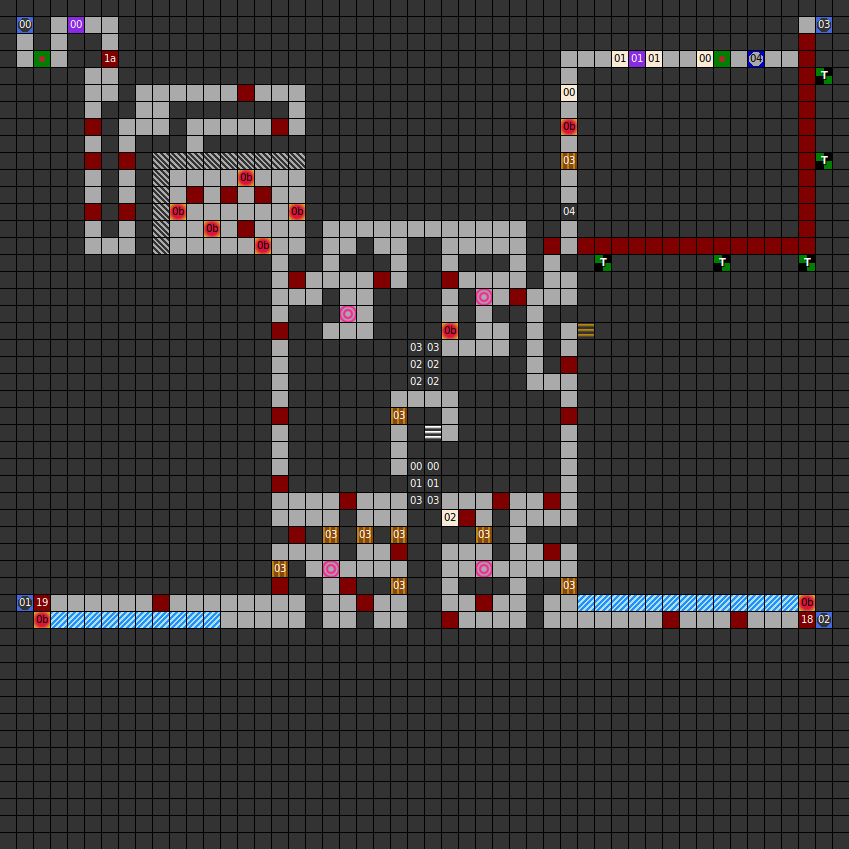

### Map

### Key

### Questions

* Question 00: WHEN YOU LOOK AT ME YOU WILL SEE YOU! (En);
      DEINE FEINDE FESSLEN DICH MIT MEINEN EISERNERN GLIEDER.NENNE MEINEN NAMEN! (De)
* Answer 00: MIRROR (En);
      KETTE (De)
^
* Question 01: ONLY I CAN BRING YOU OVER THE RIVER STYX! WHAT IS MY NAME ? (En);
      ICH BRINGE DICH &Uuml;BER DEN REI&szlig;ENDEN STYX. NENNE MEINEN NAMEN ! (De)
* Answer 01: CHARON (En);
      CHARON (De)

### Messages

* 00: YOU HEAR THE SOUNDS OF A RIVER! (En);
      DU H&Ouml;RST VON FERNE EINEN FLU&szlig;! (De)
* 01: YOU ARE AT THE BANK OF THE RIVER STYX. (En);
      DU STEHST AM UFER DES REI&szlig;ENDEN STYX. (De)
* 02: ONLY CHARON CAN BRING YOU OVER THE STYX. (En);
      CHARON BRINGT DICH &Uuml;BER DEN STYX. (De)

### Chests

* 00: _(Unused)_ (Unlocked) Arc's Axe, Arc's Sword, Arc's Boolas, Killersword

### Fixed monster encounters

* 18: 24 worms
* 19: 25 worms
* 1a: 26 worms

### Notes

* Completing this level requires you to wade through the top-right corridor
  with a monster encounter on every single square. You must fight 26 in all
  in order to reach the button necessary to unlock part of the path to proceed.
* In addition, you need to either press the button in the southeast of the map,
  _or_ both the northwest and southwest. There's no reason to do both.
* This is the only level of the game with no treasure chests.
* The German version of the first riddle has a different meaning: "Your enemies
  bind you with my iron links. What is my name?" The answer is "chain".
* There are no chests on this level, but there is one assigned to the level in
  the chest list. It contains powerful items but is unused.

Prev: [&laquo; Map: Rhateph's Castle (DoA1), level 2](doa1-castle2.html)

Next: [Map: Rhateph's Castle (DoA1), level 4 &raquo;](doa1-castle4.html)
