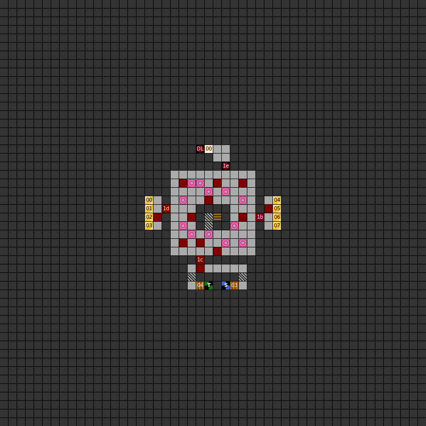
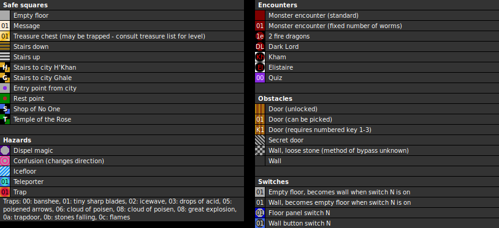

Flee chance: 7/16 (43.75%)

### Map

### Key

### Questions

* Question 00: R&Auml;TSEL 00 (En);
      R&Auml;TSEL 00 (De) _(Unused)_
* Answer 00: L&Ouml;SUNG 00 (En);
      L&Ouml;SUNG 00 (De) _(Unused)_

### Messages

* 00: YOU WILL FACE YOUR ENEMY. DARK LORD IS WAITING FOR YOU! PREPARE TO DIE HUMANS! (En);
      DU STEHST NUN ENDLICH VOR DEINEM FEIND DARKLORD. ZEIT ZU STERBEN !!!! (De)

### Chests

* 00: Elf arrows x3, healing potion x2
* 01: Kel's Arrows, arrows x2
* 02: (Small explosion trap) Stemberfang
* 03: (Acid trap) Empty
* 04: Healing potion x4
* 05: 100g
* 06: (Small explosion trap) Empty
* 07: (Unlocked) Healing potion x4 (pois)

### Random monster encounters

* 1-5 groups of 1-6 Green Dragon, Guard, or Hellworm

### Fixed monster encounters

* 1b: 27 worms
* 1c: 28 worms
* 1d: 29 worms
* 1e: 2 fire dragons
* 1f: Dark Lord, 5 fire trolls, 8 fire trolls

### Dark Lord encounter

Due to the
[fixed-encounter record bug](../game/bugs.html#victory-conditions-dont-trigger),
the final boss encounter is much more difficult than intended, and the victory
screen doesn't trigger. The game fails to record enemies killed in fixed
encounters, so you have to kill all 14 enemies in a single battle.

However, it's not unwinnable fight. The following advice may help:

- The Anti-Aura scroll effect persists, even if you flee the battle or save and
  load.
- The fastest way to kill the Fire Trolls is the spell Medusas Eye (Magician 7 /
  Wizard 7, 40 MP), which instantly kills an entire group of enemies.
- The fastest way to kill the Dark Lord is the spell Deadly Flash (Magician 5 /
  Wizard 5, 24 MP). Against the Dark Lord it deals 240-367 damage; the Dark Lord
  has 999 HP, so 3 or 4 casts should do the trick.
- Given that the fastest way to win the battle is to cast 6 spells, at a total
  cost of more MP than any one hero can have, the most effective strategy is to
  have two casters in the party. At least one should be a Magician, as the
  defensive advantage of their Magic Armour (+3) is critical. The sole purpose
  of the front four heroes is to buy time for the two casters in the back row.
- The Dark Lord instant kills one hero per turn, with a 50-50 chance to use
  Deadly Flash (targets one of the front four) or melee attack (targets one of
  the front two). However, there are two possible ways to survive:
  - The Dark Lord's Attack stat is 20, meaning you will survive (15/16 chance)
    if you can get your WC to 20. It's possible for at most two characters to
    achieve this at a time, and placing them in your front row lets them tank
    all melee attacks and 50% of Deadly Flash. This gives the party about a 70%
    chance survive a round without losing a member, which keeps both
    spellcasters in the back row where they can't be hit.
    - The specific build is as follows: A Level 16 character with 80+ Luck
      (average) adds +3 to WC, the Magician spell Magic Armour adds +3, and
      using the Parry option effectively adds +3. The remaining 11 points come
      from items usable by Fighter, Knight, or Hunter: Ara's Shield or Fire
      Shield (+4), Ara's Armour or Knights' Armour (+3), either Battle Helmet
      (+3) or Arc's Helmet or Power Helmet (+2) plus Bee-Ring (+1), and one of
      Arc's weapons or the swords Deathbringer or Killersword (+1).
  - A Troll or Stemb&auml;r with above-average HP rolls can have 204+ HP,
    allowing them to survive a single melee hit (200-203 damage). However, their
    low Luck maxes their innate AC bonus at +2, so they aren't qualified for the
    WC 20 front line; their MP is bad too. They're best suited to Thief and
    placed in the center-left slot, to be promoted to the front line in case one
    falls.

If you already reached the final boss with the default team and have only one
Deadly Flash caster (Wynder, the default Wizard), it's much more difficult,
but perhaps not impossible.

- The Wizard spell Magic Armour2 only grants +2 WC. This means only one hero,
  equipped with both the Battle Helmet and Bee-Ring, can Parry the Dark Lord,
  which reduces your chance of the whole party surviving a round from 70% to
  about 23%.
  Give this to the second hero (top-right); the first hero hits earlier in the
  initiative order.
- Ignore the Fire Trolls at first. They only target the front row and can't
  hit any hero with WC 15 (moderately equipped Fighter, Knight, or Hunter), or
  WC 12 plus Parry (optimally equipped Thief). With the 1/16 chance, the
  average number of Troll hits per turn is 0.8.
- Wynder's average HP total at level 16 is 119, exactly enough to cast Magic
  Armour2 before the fight, Deadly Flash three times, and Medusas Eye against
  the stack of 8 Fire Trolls.
- The hero in the first slot should have Arc's Sword and attack the Dark Lord.
  The goal is to deal supplemental damage to increase the chances of Wynder
  killing him in only three turns; on average, one Arc's Sword hit is
  approximately enough.
- There is a 25% chance for the party to gain initiative at the start of
  battle. The main advantage is that it guarantees the first hero goes before
  the Dark Lord.

### Notes

* Avoid the southmost chest in the west treasure room, and the second chest
  from the south in the east treasure room. They are trapped and empty.
  The second chest from the south in the west room is also trapped, but
  contains the weapon Stemberfang.
* There are no rest points on this level. There are two in the level below,
  in the northeast and northwest of the map respectively.
* The unused questions simply read "Riddle 00" and "Solution 00" in German.
  No question squares appear on this level.

Prev: [&laquo; Map: Rhateph's Castle (DoA1), level 3](doa1-castle3.html)

Next: [How to see the Dungeons of Avalon 1 ending &raquo;](../secrets/doa1-ending.html)
