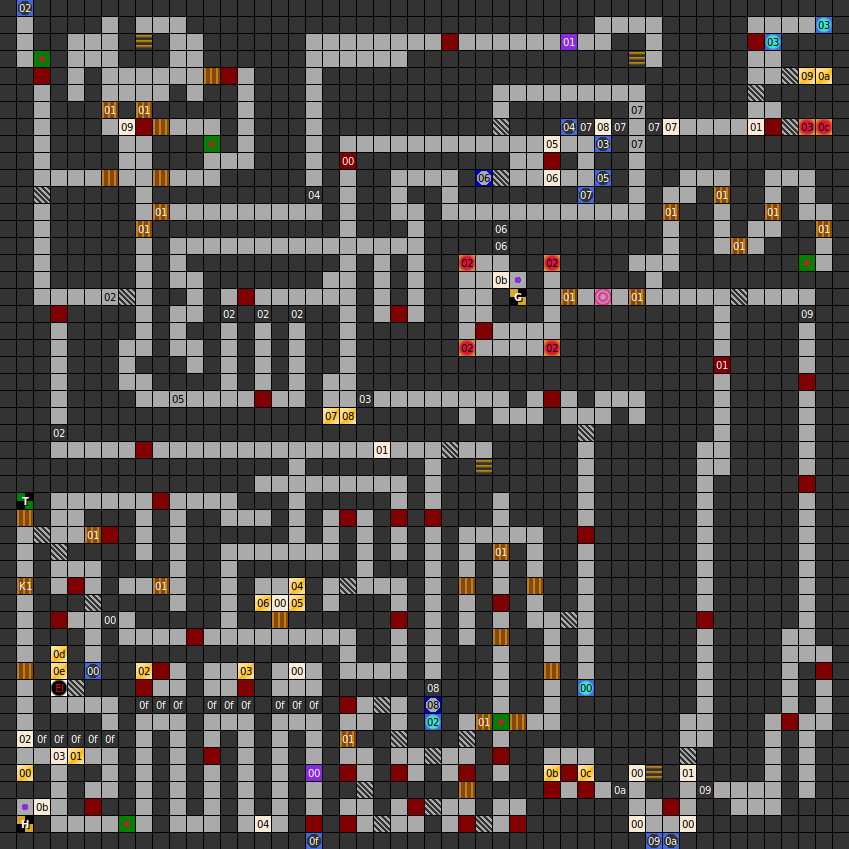

### Map

### Key

### Questions

* Question 00: "WHAT ARE YOU SEARCHING FOR ,HERE IN THE DUNGEONS?" (En); "NENNE DAS ZIEL EURER SUCHE IN DIESEM VERLASSENEN DUNGEON.?" (De)
* Answer 00: RUNE (En); RUNE (De)
^
* Question 01: "WHAT IS THE NAME OF THE DRAGON,  WHO ASKS YOU FOR THE DAGGER?" (En); "WIE LAUTET DER NAME DES DRACHEN, DER EUCH NACH EINEM DOLCH  FRAGTE.?" (De)
* Answer 01: ELISTAIRE (En); ELISTAIRE (De)
^
* Question 02: "WHO SINGS THE BARD-SONGS?" (En); "WER SINGT DIE LUSTIGEN LIEDER AUF EINER WANDERSCHAFT?" (De)
* Answer 02: BARD (En); BARDE (De)

### Messages

* 00: THE EXIT IS IN THE NORTHEAST! (En); DER AUSGANG IST IM NORDOSTEN ! (De)
  _(Appears in 5 places)_
* 01: THE SEARCHER WILL FIND IT. (En); WER HIER SUCHT DER WIRD ES FINDEN! (De)
  _(Appears in 3 places)_
* 02: WELCOME TO MY NIGHTMARE!! (En); WILLKOMMEN IN MEINEM ALPTRAUM !! (De)
* 03: YOU ARE NEARLY THERE! (En); IHR SEIT FAST DA !!! (De)
* 04: THEY ARE ONLY FEW METERS TO GO. (En); ES SIND NUR NOCH WENIGE METER. (De)
* 05: THE HALL OF SWITCHES! (En); DIE HALLE DER SCHALTER. (De)
* 06: CHOOSE VERY WISELY YOU WANDERER. (En); WANDERER ,TREFFT EURE WAHL SEHR WEISE! (De)
* 07: I WOULD NOT GO THERE IF I WERE  YOU! (En); ICH ,AN EURER STELLE W&Uuml;RDE HIER NICHT WEITERGEHEN. (De)
* 08: GOLD! GOLD! GOLD! I CAN SMELL IT! (En); GOLD! GOLD! GOLD! ICH RIECHE GOLD!? (De)
* 09: HALL OF THE DORRS TO NOWHERE! (En); HALLE DER T&Uuml;REN INS NIERGENDWO! (De)
* 10: TEXT 10 (En); TEXT 10 (De)
* 11: SEARCH FOR THE "RUNE"! (En); SUCHE DIE "RUNE"! (De)
* 12: ................................ ................................ (En); ................................ ................................ (De)

### Chests

* 00: Sword, armour, magic eye
* 01: Battle axe
* 02: (Cold wave trap) Wasp sting
* 03: (Unlocked) Sword, 100g, key 1
* 04: 400g, ruby dagger
* 05: (Cold wave trap) Empty
* 06: (Cold wave trap) Empty
* 07: (Poisened blades trap) Magic eye
* 08: Sword, 60g
* 09: 500g
* 0a: (Acid trap) Restoration
* 0b: Scroll 2, 100g
* 0c: (Unlocked) War staff, 100g
* 0d: (Unlocked) 5000g, broadsword, dagger, club, magic eye
* 0e: (Unlocked) 5000g, broadsword, dagger, club

### Notes

* The entry to this level from the starting city is in the bottom-left of
  the map.
* Most of this level is inaccessible until you have been to the second level of
  the dungeon.
* This level has more treasure chests than any other level in the game.
* In the room with three chests, the one in the northeast contains the ruby
  dagger. The others are trapped and contain nothing. The message
  "The exit is in the northeast" is a clue to this.
* You don't actually have to give Elistaire the ruby dagger to proceed.
  However, he guards a huge amount of treasure.
* The combat encounter directly north of the chest which gives a sword and 60g
  always contains 5 worms.
* This level has 4 stairways down.

Next: [Map: The Dungeon (DoA1), level 2" &raquo;](doa1-dungeon2.html)
