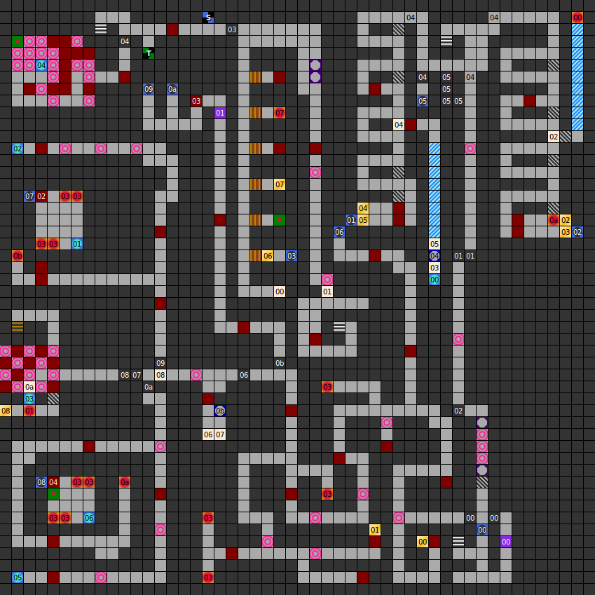

### Map

### Key

### Questions

* Question 00: "HOW ARE THE WINGED HORSE CALLED?" (En);
      "WIE WIRD DAS GEFL&Uuml;GELTE PFERD GENANNT?" (De)
* Answer 00: PEGASUS (En);
      PEGASUS (De)
^
* Question 01: "TO WHAT DID THE SNAKE-HEADED MEDUSA TURN YOU?" (En);
      "ZU WAS WANDELT EUCH DIE SCHLANGENH&Auml;UPTIGE MEDUSA?" (De)
* Answer 01: STONE (En);
      STEIN (De)

### Messages

* 00: HERE WILL YOU FIND NOTHING SEARCH IN THE NORTH. (En);
      HIER FINDEST DU NICHTS SUCHE IN RICHTUNG NORDEN. (De)
* 01: FAR, FAR AWAY IS THE SECOND CITY OF AVALON! (En);
      WEIT , WEIT IST ES NOCH ZUR STADT IHR PILGER. (De)
* 02: LOOK STRAIGHT TO THE EAST. (En);
      SCHAUE GENAU NACH OSTEN ! (De)
* 03: GO S,W,W,S,S,E,E,E,E,E,N,N! (En);
      GEHE S,W,W,S,S,O X 5 ,N,N (De)
* 04: DEATHEND OF THE GOLD! (En);
      DIE SACKGASSE DES GOLDES! (De)
* 05: TELEPORTER ;  GO TO THE SOUTH! (En);
      TELEPORTER ;  NACH S&Uuml;DEN GEHEN ! (De)
* 06: TELEPORTER ARE THE SOLUTION FOR YOU! (En);
      TELEPORTER SIND DEINE  L&Ouml;SUNG! (De)
* 07: SEARCH IN THE NOTHWEST AND IN THE SOUTHWEST TOO. (En);
      SUCHE IM NORDWESTEN UND AUCH IM S&Uuml;DWESTEN! (De)
* 08: YOU MUST FIND THE SWITCHES! (En);
      DIE SCHALTER GILT ES ZU FINDEN! (De)
* 09: DANGER!! (En);
      GEFAHR ! (De)

### Chests

* 00: Helmet, broadsword
* 01: Club, 120g
* 02: (Poisened blades trap), restoration
* 03: Elf bones, dagger, 20g
* 04: (Unlocked) Staff, wood shield, 20g
* 05: 200g
* 06: (Poisened thorns trap), 200g
* 07: (Poisened thorns trap), Scroll 1, 40g
* 08: (Unlocked) Healing potion x2, arrows, restoration

### Notes

 Beard
{:.right}

* The elf bones found in chest 03 can be dragged into an empty party member
  slot. If raised, elf bones become an NPC named Beard. Beard is level 16,
  has 135 HP, and all his stats are 160.
* This level has four stairs up to the previous level.
* This level introduces the dispel magic squares, which cause spells to stop
  functioning.
* This level has the only shop in the Dungeon.
* Scroll 1 reads "The good magician of Avalon was called Kham."

Prev: [&laquo; Map: The Dungeon (DoA1), level 1](doa1-dungeon1.html)

Next: [Map: Dungeon of H'Khan (DoA1), level 3 &raquo;](doa1-dungeon3.html)
