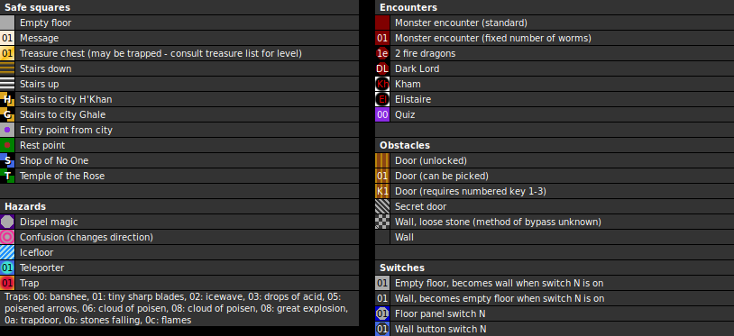

### Map

### Key

### Questions

* Question 00: STONE-PAPER SCISSOR-STONE PAPER-?? (En);
      STEIN-PAPIER SCHERE-STEIN PAPIER-?? (De)
* Answer 00: SCISSOR (En);
      SCHERE (De)
^
* Question 01: YOU ARE WELCOME MY ... (En);
      DU BIST WILLKOMMEN TRETE EIN (De)
* Answer 01: FRIEND (En);
      FREUND (De)

### Messages

* 00: THE ROCKS ARE VERY LOOSE HERE! (En);
      DAS GESTEIN HIER IST VERDAMMT LOSE. (De)
* 01: AT FIRST FIND THE POINT X1 AND THE RETURN TO HERE. (En);
      SUCHE ERST PUNKT X1, DANN KOMME WIEDER. (De)
* 02: YOU REACHED POINT X1. (En);
      PUNKT X1 IST EREICHT! (De)
* 03: DEAD END. (En);
      DEAD END.(SACKGASSE) (De) _(unused)_
* 04: BEWARE OF THE MONSTER HERE! (En);
      IHR DIE IHR HIER EINTRETET LASSET ALLE HOFFNUNG FAHREN! (De)
      _(appears 3 times)_
* 05: SEARCH FOR THE RIGHT KEYS MY FRIEND. (En);
      SUCHE DIE RICHTIGEN SCHL&Uuml;SSEL (De)
* 06: SAY FRIEND AND BE WELCOME! (En);
      SAGE FREUND UND TRETE EIN! (De)
* 07: THE SEARCHER WILL FIND ... (En);
      WER SUCHT ...... (De)
* 08: GO TO THE PARALLEL WAY WICH IS TO THE SOUTH OF THIS WAY. (En);
      GEHE DEN LINKEN S&Uuml;D-LICHEN PARALLELGANG HINUNTER (De)

### Chests

* 00: Key 1, mace, 100g
* 01: Key 1, broadsword, key 1, antipoisen
* 02: 1000g, healing potion (pois), key 1 _(inaccessible)_
* 03: (Acid trap) antipoisen
* 04: Dagger, club, wood shield, Arc's Boolas
* 05: 100g, dagger, new live
* 06: 40g
* 07: (Acid trap) antipoisen

### Notes

* The message which says "the rocks are very loose here" is telling the truth:
  the adjacent blocks are actually a separate block type in the data file.
  However, the method of breaking down loose rock is unknown.
* Chest 02 is inaccessible without a way to bypass loose rock. It contains
  1000 gold but nothing critical.
* This is the only level to include switch 0x16. It's unnecessary, since the
  more commonly used switch F is unused in this level.
* Message 3, "Dead end", appears in the game file but is unused in the map.

Prev: [&laquo; Map: The Dungeon (DoA1), level 2"](doa1-dungeon2.html)

Next: [Map: Dungeon of H'Khan (DoA1), level 4" &raquo;](doa1-dungeon4.html)
