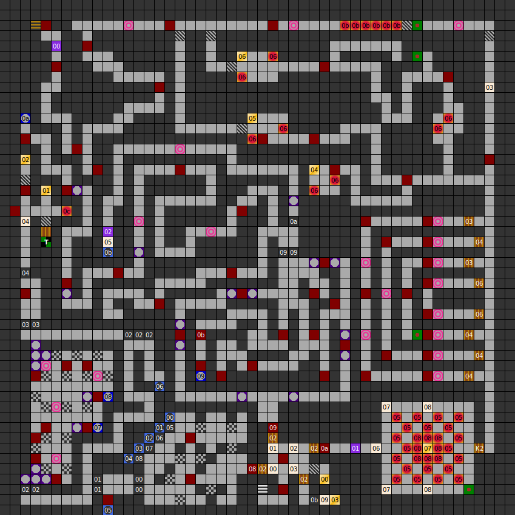

### Map

### Key

### Questions

* Question 00: TELL ME THE OWNER OFT THE SWORD EXCALIBUR! (En);
      WEM GEH&Ouml;RTE DAS SCHWERT EXCALIBUR ? (De)
* Answer 00: ARTHUR (En);
      ARTHUR (De)
^
* Question 01: TELL ME THE LORD OF THIS DUNGEON! (En);
      WIE LAUTET DER NAME DES BESITZERS DIESES DUNGEON ? (De)
* Answer 01: DARK LORD (En);
      DARK LORD (De)
^
* Question 02: WHAT ITEM DID A MAGICIAN NEED TO CAST SPELLS? (En);
      WAS BRAUCHT EIN ZAUBER-KUNDIGER F&Uuml;R SEINE KUNST ? (De)
* Answer 02: SPELLBOOK (En);
      ZAUBERBUCH (De)

### Messages

* 00: EASIEST WAY! (En);
      LEICHTER WEG. (De)
* 01: MEDIUM WAY! (En);
      MITTELSCHWERER WEG. (De)
* 02: HEAWIEST WAY! (En);
      SEHR SCHWERER WEG. (De)
* 03: WHO SEARCHES WILL ... (En);
      WER SUCHT.... (De)
* 04: CHOOSE THE RIGHT THING! (En);
      TREFFE DOIE RICHTIGE ENTSCHEIDUNG. (De)
* 05: HERE, YOU WILL FIND NOTHING! (En);
      APRIL,APRIL HIER FINDEST DU NICHTS KEHRE UM !! (De)
* 06: KEEP NEAR BY THE WALLS. (En);
      IMMER AN DER WAND LANG. (De)
* 07: THEY ARE SOMETHING VALUABLE IN THE MIDDLE OF THS ROOM. (En);
      IN DER MITTE DIESES RAUMES IST ETWAS WERTVOLLES VERBORGEN. (De)
* 08: GO THE THE CENTER OF THIS ROOM! (En);
      WARST DU SCHON IN DER MITTE DES RAUMES? (De)
* 09: FOLLOW THE HEAWIEST WAY. (En);
      GEHE NACH "SEHR SCHWERER WEG". (De)

### Chests

* 00: Key 1, key 2, key 2, longbow, 300g
* 01: Key 2, key 2, knight armour, scroll 2, eaglefang
* 02: Arc's Helmet, Arc's Sword, Arc's Boolas, robe, arrows, elf arrows
* 03: Ara's Armour, longbow, ruby dagger, 300g, key 2
* 04: (Small explosion trap) Magic-staff, wizard-staff, buckler
* 05: Dwarf bones, Ara's Armour, knight armour, buckler, elf arrows
* 06: (Small explosion trap) 100g, firedagger
* 07: (Small explosion trap) Arc's Axe, Sefer's Helmet, magic-staff

### Notes

* This level has the only door in the game that requires Key 2.
* The labels on the three routes are misleading: "easiest way" has a lot of
  switches, "medium way" winding corridors and a riddle, and "heawiest way"
  leads directly to the way out.
* All three routes ultimately lead you through "heawiest way".
  1. "Easiest way" leads to a temple and chests 01 and 02, which give
  key 2, scroll 2 and Arc's Helmet, Sword and Boolas. You need to take key 3
  through "heawiest way" to progress.
  2. "Medium way" ends with a wall button which unlocks an alcove in the
  starting area containing key 2, Ara's Armour, and another ruby dagger.
  3. "Heawiest way" leads directly to the end but you need the key from
  chest 00, behind a secret door in the starting area.
* Only two longbows can be found in the entire game, both in chests near the
  start of this level. A third can be found in Simharon's starting
  inventory.
* The dwarf bones found in chest 05 can be dragged into an empty party member
  slot. If raised, dwarf bones become an NPC named Clint. He is level 20, has
  124 hit points, and all his stats are 200.

Prev: [&laquo; Map: The Dungeon (DoA1), level 3"](doa1-dungeon3.html)

Next: [Map: Dungeon of H'Khan (DoA1), level 5" &raquo;](doa1-dungeon5.html)
