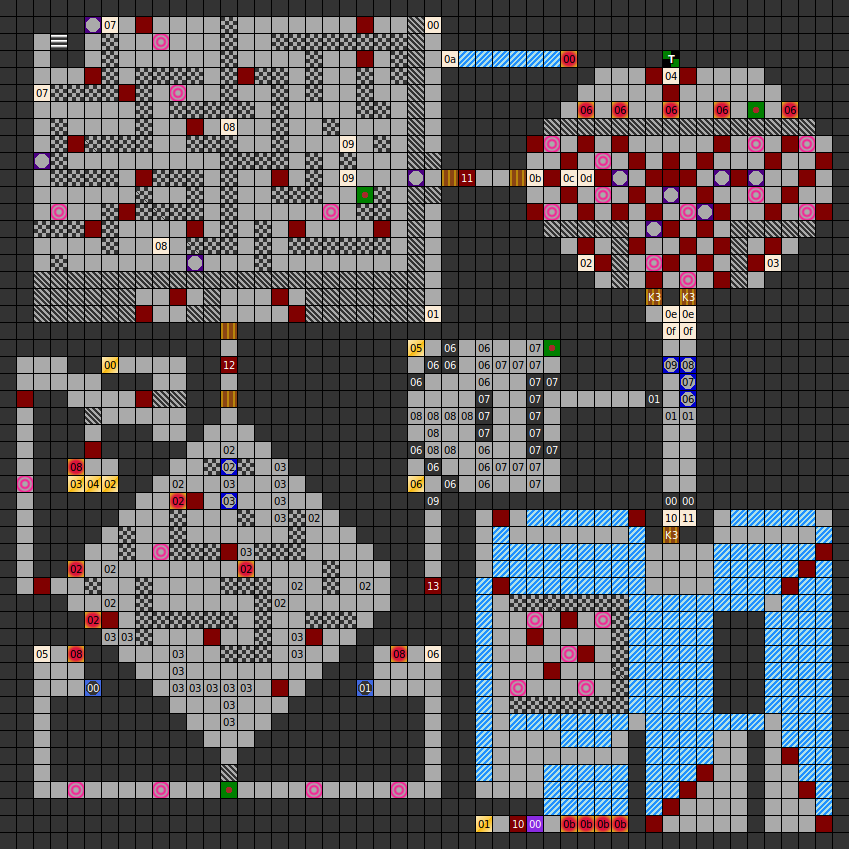

### Map

### Key

### Questions

* Question 00: TELL ME THE MESSAGE! (En);
      VERK&Uuml;NDE DIE BOTSCHAFT: (De)
* Answer 00: THE UNICORN IS ALIVE (En);
      DAS EINHORN IST AM LEBEN (De)

### Messages

* 00: PART 1: "THE". (En);
      TEIL 1:"DA ". (De)
* 01: PART 2: "UNI". (En);
      TEIL 2:"SEI". (De)
* 02: PART 3: "COR". (En);
      TEIL 3:"NHO". (De)
* 03: PART 4: "NI ". (En);
      TEIL 4:"RNI". (De)
* 04: PART 5: "SA ". (En);
      TEIL 5:"STA". (De)
* 05: PART 6: "LI ". (En);
      TEIL 6:"MLE". (De)
* 06: PART 7: "VE ". (En);
      TEIL 7:"BEN". (De)
* 07: THE MAGIC ANIMAL  IS CUTTED UP INTO PIECES (En);
      DAS MYSTISCHE TIER WARD ZERST&Uuml;CKELT (De)
* 08: ASSEMBLE THE MAGIC ANIMAL! (En);
      F&Uuml;GE DAS TIER ZUSAMMEN ! (De)
* 09: SPREAD THE MESSAGE! (En);
      VERK&Uuml;NDE DIE BOTSCHAFT ! (De)
* 0a: PRIVATE PROPERTY! ENTER OF OWN RISK! (En);
      BETRETEN VERBOTEN ! (De)
* 0b: ROOM OF BATTLES... (En);
      RAUM DER SCHLACHT.... (De)
* 0c: ROOM OF HEALING.. (En);
      UND DER HEILUNG.... (De)
* 0d: FIND THE TEMPLE! (En);
      SUCHE DEN TEMPEL.... (De)
* 0e: OH, I AM SUPRISED YOU ARE HERE! (En);
      SO , SO ,  IHR HABT ES BIS HIER HIN GESCHAFFT !? (De)
* 0f: ARE YOU ALL HERE?? (En);
      DANN WERDE ICH JETZT ST&Auml;RKERE GESCH&Uuml;TZE GEGEN EUCH AUFAHREN!! (De)
* 10: NO KEY? USE THE SWITCH ON THE WALL! (En);
      SEIT IHR ALLE NOCH DA? (De)
* 11: _(missing_) (En);
     KEIN SCHL&Uuml;SSEL? BET&auml;TIGE EINEN SCHALTER AN DER WAND NOCHMAL !

### Chests

* 00: Ara's Shield, metal shield, crossbow, battle helmet, key 3
* 01: The Rune, wasp sting, bolas, Deathbringer, power helmet, dwarf bones
* 02: (Small explosion trap) Arc's Speer
* 03: 200g, elf arrows x2, healing robe x2
* 04: (Small explosion trap) healing potion x2
* 05: Key 3, 200g
* 06: (Acid trap) scroll 3, Arc's Boolas, Killersword

### Notes

* The dwarf bones found in chest 01 with The Rune can be dragged into an empty
  party member slot. If raised, dwarf bones become an NPC named Clint. He is
  level 20, has 124 hit points, and all his stats are 200.
  * Strangely, there is
  also a dwarf bones on the previous level, meaning you can have two Clints
  in your party. This may be an error, as gnom bones for the NPC Hanibal are
  coded into the game but never appear in any chest.
* One floor message is missing from the English translation list, causing all
  subsequent messages to be off by one. All affected locations are in the same
  two block wide corridor in the east of the map.
  * The square in front of the south door, which says
  "No key? Use the switch on the wall!" should read
  "Are you all here?"
  * The square adjacent to it, which has
  no message, should read
  "No key? Use the switch on the wall!"
  * The two squares to the north of the room, which read
  "Are you all here?" should have the line
  "Then I will now raise stronger guns against you!"
  * The message north of it,
  "Oh, I am surprised you are here!" is correct.

Prev: [&laquo; Map: The Dungeon (DoA1), level 4"](doa1-dungeon4.html)

Next: [Map: Tower of Rhateph (DoA1), level 1" &raquo;](doa1-tower1.html)
