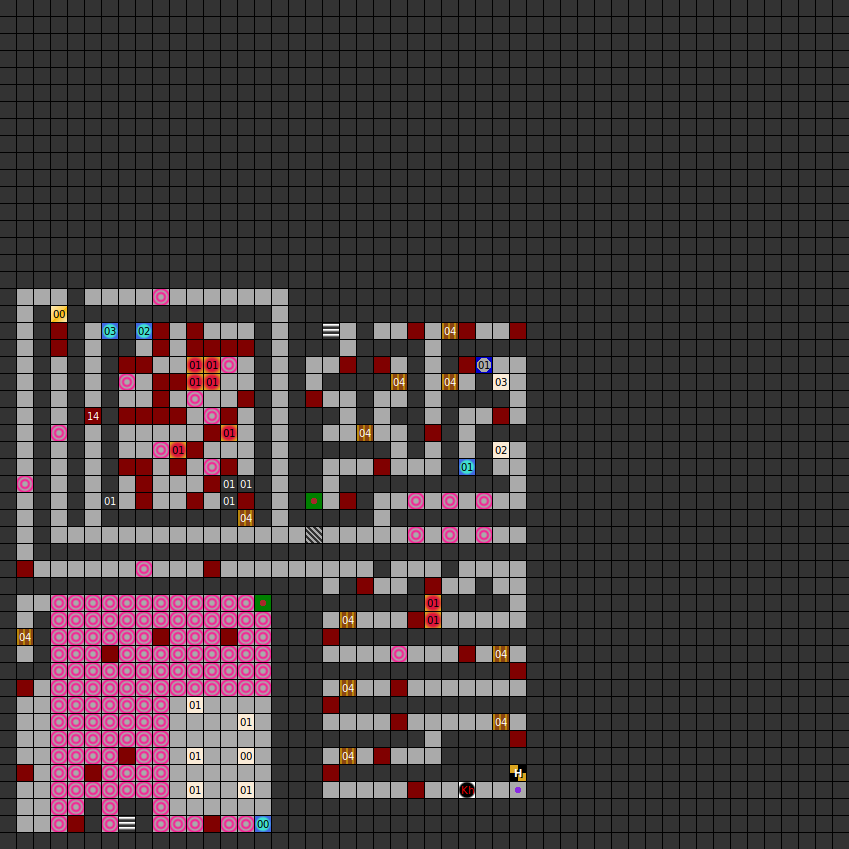

### Map

### Key

### Questions

* Question 00: WHAT DID A KING WEAR? (En);
      WAS IST EINES K&Ouml;NIGS INSIGNIE ? (De) _(unused)_
* Answer 00: CRONE (En);
      KRONE (De) _(unused)_

### Messages

* 00: SEARCH THE WAY UP! (En);
      SUCHE DEN AUFGANG. (De)
* 01: FIND THE SWITCH. (En);
      FINDE DEN SCHALTER. (De)
* 02: BE A HERO OR YOU WILL DIE. (En);
      SEIT TAPFER ODER IHR WERDET STERBEN! (De)
* 03: THE RIDDLES ANSWER IS:  "NOT DARK!" (En);
      DES R&Auml;TSELS L&Ouml;SUNG LAUTET: &#96;NICHT DUNKEL&#96;! (De)

### Chests

* 00: Key 4, fire shield, bee-ring, troll bones

### Notes

* The troll bones found in the chest can be dragged into an empty party member
  slot. If raised, troll bones become an NPC named Ak'Heem. Ak'heem is level 16,
  has 73 hit points, and all his stats are 99.
* This level has the most spinners (confusion/twister tiles)
  of any level in the game (142).
  In fact, it has more spinners than the entire rest of the game
  combined (124).
* Key 4 is never used.
* The riddle's answer is misspelled. It should be CROWN, not CRONE.
  However, no riddle square appears in this level.
  This is the only level aside from the final level of the tower
  that has no riddles.
* This level has two stairs up to the next level.
  Levels 1 and 2 are the only tower levels connected at more than
  one point like this.
  Since it's a tower rather than a dungeon, you progress
  by going up, rather than down.
* Although you enter the tower from Ghaele city, the stairs return you to H'Khan
  city.

Prev: [&laquo; Map: The Dungeon (DoA1), level 5](doa1-dungeon5.html)

Next: [Map: Tower of Rhateph (DoA1), level 2 &raquo;](doa1-tower2.html)
