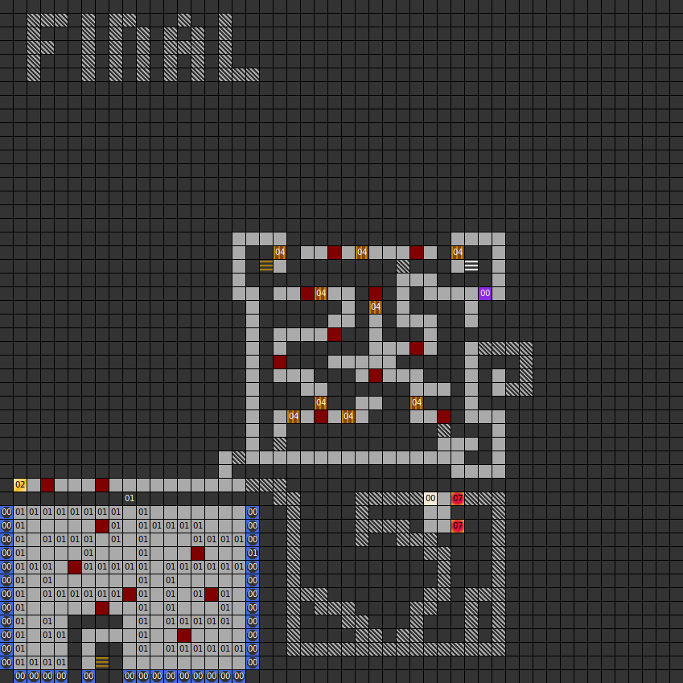

### Map

### Key

### Questions

* Question 00: TELL ME WHAT IS "NOT DARK" ? (En);
      NENNE MIR DES R&Auml;TSEL L&Ouml;SUNG! DENKE DARAN ES IST "NICHT DUNKEL" ! (De)
* Answer 00: BRIGHT (En);
      HELL (De)

### Messages

* 00: TEXT 00 (En);
      TEXT 00 (De)

### Chests

* 02: Eagles view

### Notes

* There are two stairways down to level 1.
* Most of the 38 buttons in the button room don't do anything.
* Two locations on the map have long series of secret doors.
  They lead nowhere.
* Most of this map leads nowhere.
* A default message, "TEXT 00", was left in by mistake.
  It can be found at the end of the longest series of
  secret doors.

Prev: [&laquo; Map: Tower of Rhateph (DoA1), level 1](doa1-tower1.html)

Next: [Map: Tower of Rhateph (DoA1), level 3 &raquo;](doa1-tower3.html)
