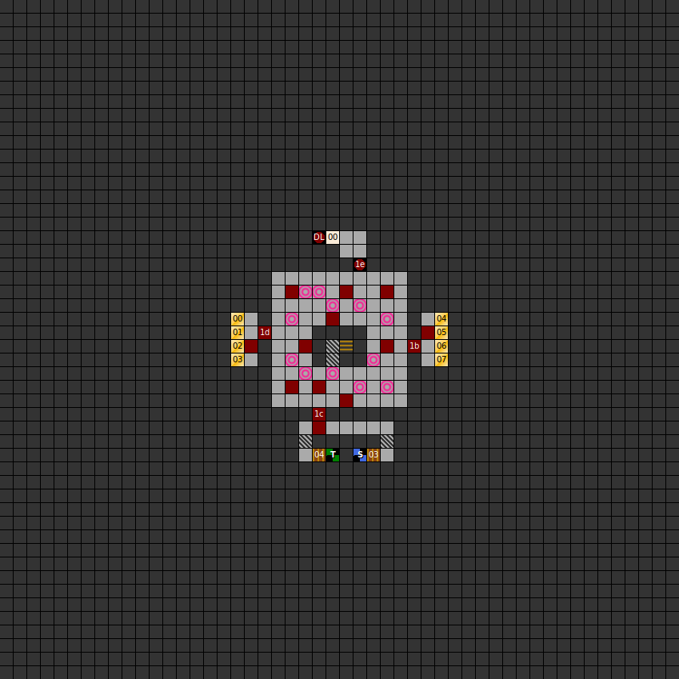

### Map

### Key

### Questions

* Question 00: R&Auml;TSEL 00 (En);
      R&Auml;TSEL 00 (De) _(Unused)_
* Answer 00: L&Ouml;SUNG 00 (En);
      L&Ouml;SUNG 00 (De) _(Unused)_

### Messages

* 00: YOU WILL FACE YOUR ENEMY. DARK LORD IS WAITING FOR YOU! PREPARE TO DIE HUMANS! (En);
      DU STEHST NUN ENDLICH VOR DEINEM FEIND DARKLORD. ZEIT ZU STERBEN !!!! (De)

### Chests

* 00: Elf arrows x3, healing potion x2
* 01: Kel's Arrows, arrows x2
* 02: (Small explosion trap) Stemberfang
* 03: (Acid trap) Empty
* 04: Healing potion x4
* 05: 100g
* 06: (Small explosion trap) Empty
* 07: (Unlocked) Healing potion x4 (pois)

### Notes

* The Dark Lord is accompanied by a large numebr of fire trolls, and widely
  believed to be unbeatable. Your characters will have reached the level cap of
  16 at this point, and cannot level further. You can flee from the boss and
  return, but since this is a fixed encounter, his full retinue of fire trolls
  will return.
* If you somehow defeat the Dark Lord, a bug prevents the victory screen
  from loading.
* Avoid the southmost chest in the west treasure room, and the second chest
  from the south in the east treasure room. They are trapped and empty.
  The second chest from the south in the west room is also trapped, but
  contains the weapon Stemberfang.
* There are no rest points on this level. There are two in the level below,
  in the northeast and northwest of the map respectively.
* The unused questions simply read "Riddle 00" and "Solution 00" in German.
  No question squares appear on this level.

Prev: ["&laquo; Map: Tower of Rhateph (DoA1), level 3"](doa1-tower3.html)
