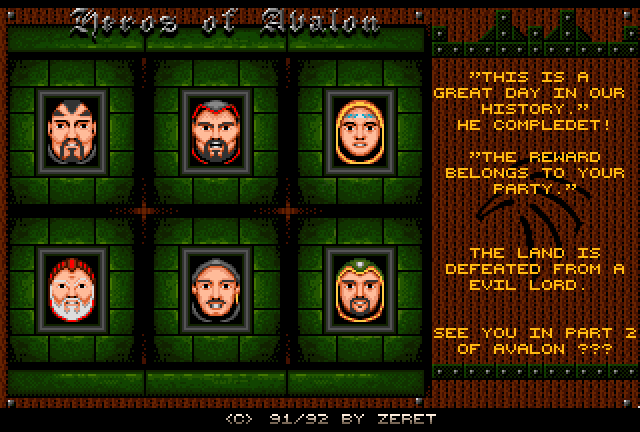
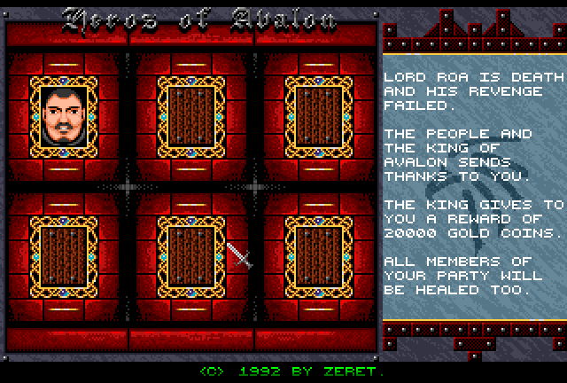

### Screenshot

 The end screen to Commodore Amiga RPG _Dungeons of Avalon_ (1992).
{:.center}

### What is the bug?

The original _Dungeons of Avalon_ is widely considered uncompletable. The final
boss is extremely difficult, maybe impossible even with max-level characters.
There is an end credits sequence in the game files, but due to a bug, even if
you beat the Dark Lord it doesn't trigger.

As a result, for 26 years, nobody had seen this game's end credits. Luckily,
it's possible to cheat and trigger it manually.

### Why does this bug occur?

Certain monster encounters in _Dungeons of Avalon_ have a fixed number and type
of enemies. With the exception of the final level of Rhateph's castle, all of
these special encounters are an increasingly large number of the Worm monster.
The final level contains encounters with 27, 28 and 29 worms, respectively,
followed by 2 fire dragons, and finally the final boss fight.

The final boss fight contains the Dark Lord, 5 fire trolls, and another 8 fire
trolls. Defeating them all should trigger an end cutscene.

Unfortunately, the function to check for the game's win condition appears to be
bugged. It checks the Dark Lord's entry in the special fixed encounter list to
see if it has been reduced to zero. However, entries in that list are not
reduced to zero when the monsters have been defeated.

### How to see the end credits

1. Configure an Amiga emulator to enable uncompressed save states.
2. Load _Dungeons of Avalon_ as normal, either loading a game or starting a new
   game.
3. Make a save state.
4. Using a hex editor, replace all instances of the following:
  * From: `011f 051e 081e`
  * To:   `001f 001e 001e` or `0000 0000 0000`
5. Load the save state again in the emulator. Make sure the game disk is still
   in the drive.
6. Enter the dungeon. If you were already in the dungeon, the end credits
   will automatically trigger.

### What happens?

An end text scroll plays, captioned "Heros of Avalon" (pictured top). It is
accompanied by unique music and portraits of the party.

The king rewards you and gives each character 20,000 gold each. This is more
gold than is found in all chests in the entire game (13,920 gp).

Clicking the left mouse button returns us to the Dragon's Cave adventurer's
guild in the City H'Khan. You're free to continue playing the game, but entering
the dungeon will just trigger the end sequence again.

The text of this end sequence can be found on the disk in the game files `S/TXE`
(English) and `S/TXD` respectively.

### Does this work on Dungeons of Avalon II?

 The end screen to Commodore Amiga RPG _Dungeons of Avalon II_ (1992).
{:.center}

Yes.

In this case, it's even easier since the executable is uncompressed (possible
thanks to the space saved by reducing the game's maps from 50x50 to 32x32).
You can hex edit the program directly, thus creating a version of the game that
automatically wins once you enter the dungeon.

In _Dungeons of Avalon II_, the bytes to be changed are:
* From: `0113 050e 060f`
* To:   `0013 000e 000f` or `0000 0000 0000`

_Dungeons of Avalon II_ is smarter and will only trigger the win scene the first
time you enter the dungeon, not every time after that.

Also, when you win, you are treated to a monster gallery.
