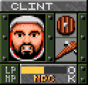
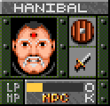
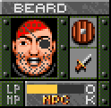

### Deleted character classes

{:.right}

{:.right}

{:.right}

Analysis of text strings appearing in the
[early alpha version](../secrets/early-alpha-version) of _Dungeons of Avalon_
reveals three unused classes: Pirat (Pirate), M&ouml;rder (Murderer), and
Barde (Bard).

While the player cannot create a character of these classes, it is possible to
recruit NPCs of this class by resurrecting bones found in the dungeon. Drag the
bones into an empty party members lot and raise them at a temple as normal.

* __Pirate__: Beard, a level 16 NPC raised from Elf Bones.
  They can be found in a chest on dungeon level 2.
  Beard has 135 HP and all his stats are 160.
* __Murderer__: Hanibal, a level 10 NPC raised from Gnom Bones.
  Does not appear in any chest in the dungeon, and can only be acquired by
  cheating.
  Hanibal has 68 HP and all his stats are 60.
* __Bard__: Clint, a level 20 NPC raised from Dwarf Bones. Appears in two
  locations: dungeon level 4, and dungeon level 5 (bottom floor).
  Clint has 124 HP and all his stats are 200.

The fourth set, Troll Bones, raises Ak'Heem, a standard thief class NPC.
Despite being raised from bones of various races, the game internally treats all
NPCs as human.

### Rune casting

The manual for the original _Dungeons of Avalon_ describes that characters would
have a stat called "rune level":

> The rune level is zero because you have to teach your hero to read runes
> later.

There is also a combat descripion line in the game for "used a rune".

This did not appear in the final game. _Dungeons of Avalon II_ removed all
mentioned of rune casting and rune level from its manual, and removed the "used
a rune" string from the game.

### Unused items

Several items appear in _Dungeons of Avalon_'s game data, but do not appear in
any chest, shop or character inventory, and cannot be obtained.

* __Kel's Crossbow__: Although Kel's Arrows appear in a chest in the top floor
  of Rhateph's castle, Kel's Crossbow doesn't. The item ID is 0x16 and it also
  appears in _Dungeons of Avalon II_, where one Kel's Crossbow can be found
  in a chest.
* __Gnom Bones__: A set of bones which, if dragged into an empty party member
  slot and resurrected, forms the NPC character Hanibal. He is level 10,
  has 68 HP, and all his stats are 60. His omission may be a bug, since two
  instances of the Dwarf Bones appear in chests in the game instead.
  The Gnom Bones item ID is 0x3e, and it does not appear in
  _Dungeons of Avalon II_, where that item slot is empty.
* __Scroll 4__: It reads "Buy Avalon II, it'll be better!" In
  _Dungeons of Avalon II_, its slot is used for the item "PERMISSION".
* __Stone-Ring__: Unknown use.
  In the early alpha version it was known as Ghal's Ring.
  Two Stone-Rings can be found in chests in _Dungeons of Avalon II_.
* __Silver-Ring__: Unknown use.
  In the early alpha version it was known as Perl's Ring.
  Three Stone-Rings can be found in chests in _Dungeons of Avalon II_.
* __"Unknown"__: Name for unidentified item. None actually appear in
  _Dungeons of Avalon_, even though shops have the option to identify items.
  One does appear in the
  [early alpha version](../secrets/early-alpha-version.html)
  of _Dungeons of Avalon_, and some appear in _Dungeons of Avalon II_.
  Note that you can't pick up an "Unknown", since it's item 00, which is used
  for empty space (e.g. an empty inventory slot). Actual unknown items have
  their first bit flipped.
* __Chest__: Unused item.
  In the beta, its slot was used for the dummy item "Empty" to signify an
  empty chest.
  In _Dungeons of Avalon II_, you can find these Chests inside chests, which
  can be sold to the shop for high amounts of cash.
* The spells Birds View, Deadly Flash, Healing II, Ice Breath, Magic Armour, and
  Restone. They can be cast by spellcasters, but no scrolls of these items
  appear.
  All appear in chests in _Dungeons of Avalon II_.

The following items appear in the item list in _Dungeons of Avalon II_, but
cannot be found in any chest:

* __Diamond__: In German, called "diamant".
  In the first _Dungeons of Avalon_, this item's slot was used by the 
  Wizard-Staff.
* __Disarm trap__: A scroll of a spell new to _Dungeons of Avalon II_.
  It can be cast as a level 7 spell for a Healer, or a level 8 spell for
  a Magician or Wizard.
* __Dragonslayer__: In German, called "Drachent&ouml;ter".
  In the first _Dungeons of Avalon_, this item's slot was used by the 
  Ruby Dagger.
  In the _Dungeons of Avalon_ early alpha version, this was the name of a
  beverage available at the tavern.
* __Scroll 3__: Simply reads "TEXT 2". Scroll 4's slot from DoA1 was replaced
  with the item Permission.

For completeness' sake, note that some other items appearing in the first
_Dungeons of Avalon_ were replaced in the second game. Club became Warhammer,
Staff became Dragonfigure, Magic-Staff became Dragonstone, Troll Bones became
Flint, and Elf Bones became Rahven. Gnom Bones, Dwarf Bones, and The Rune were
removed.

### Unused chests

Several chests appear in the game code for _Dungeons of Avalon_ but are never
used. Based on their order in the list, these chests would appear in the first
three levels of the Rhateph's Castle, which only have two actual chests betweem
them.

* #48: Closed chest containing Key 4, Fire Shield, Stone-Ring, Scroll 4, Kel's
  Arrows, two Healing Potions, two poison Healing Potions.
  Only chest containing Stone-Ring.
  Would be Castle 1 chest 01.
  Note that Castle 1's only placed chest, #47 (Castle 1 chest 00) contains Key 4,
  Fire Shield, Bee-Ring and Troll Bones, and is unlocked.
* #49: Closed chest containing Key 4, two Healing Potions, and two poison
  Healing Potions.
  Would be Castle 1 chest 02.
* #50: Closed chest containing Key 4, Antipoisen spell, and Silver-Ring.
  Only chest containing Silver-Ring.
  Would be Castle 1 chest 03.
* #51: Open chest containing an Eagles View spell.
  Would be Castle 2 chest 00.
* #52: Closed chest containing an Eagles View spell.
  Would be Castle 2 chest 01.
  Note that the following chest, #53 Castle 2 chest 02, is identical, and is the
  only chest placed on that level.
* #54: Closed chest containing an Eagles View spell.
  Would be Castle 2 chest 03.
* #55: Open chest containing two Healing Potions.
  Would be either T2 04 or a Castle 3 chest&mdash;there are no other Castle 3
  chests to compare it to.
* #56: Closed chest containing two Healing Potions.
  Would be either T2 05 or a Castle 3 chest.
* #57: Small explosion trap. Empty.
  Would be either T2 06 or a Castle 3 chest.
* #58: Small explosion trap. Empty.
  Would be either T2 07 or a Castle 4 chest.
* #59: Open chest containing Arc's Axe, Arc's Sword, Arc's Boolas, and
  Killersword.
  Would be either T2 08 or a Castle 3 chest.
  The next chest is T4 00.

There are no unused chests in _Dungons of Avalon II_.

### End credits (DoA1)

A bug in _Dungeons of Avalon_ prevents the end credits from displaying when the
final boss is defeated, essentially making it unused content.

Fortunately, by editing save states it's possible to cheat to see the
[_Dungeons of Avalon_ ending](../secrets/doa1-ending.html).
