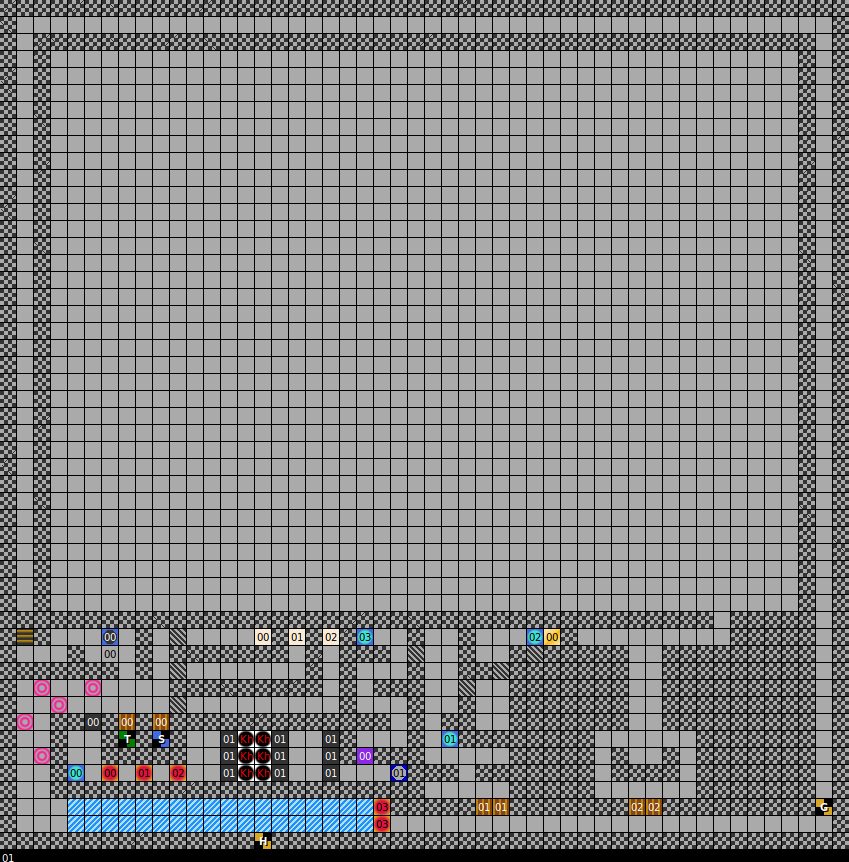
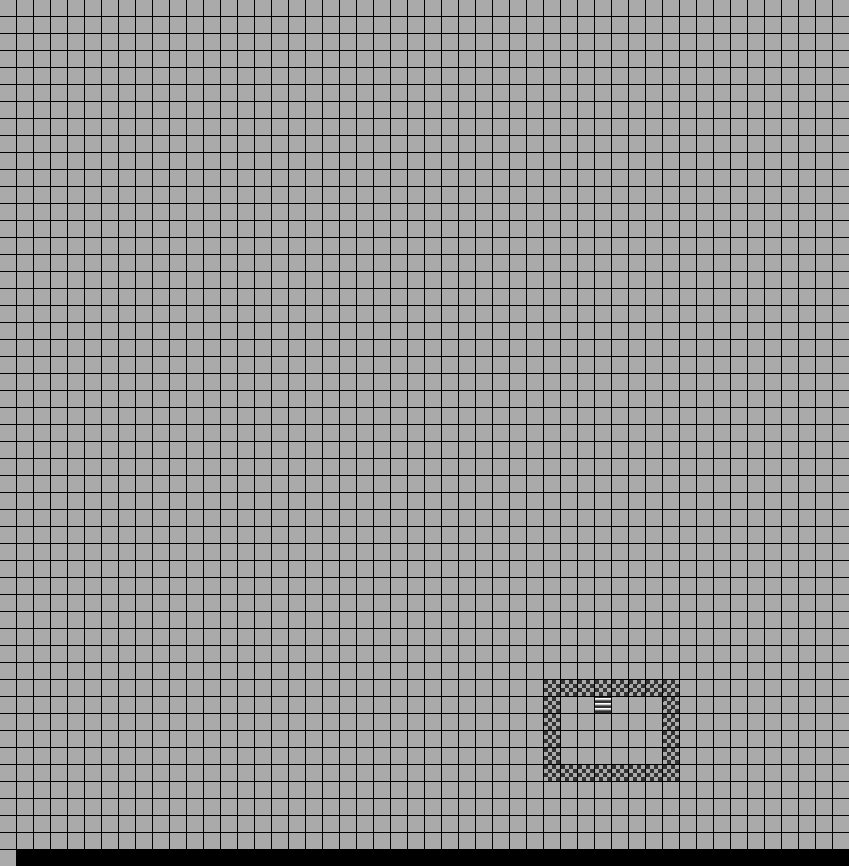

 An early release of _Dungeons of Avalon_.
{:.center}

I stumbled upon this early work-in-progress version of _Dungeons of Avalon_.
Based on the last modified date on the disk's files, this version was prepared
by the game's programmer on 8 May 1991, and later published by pirate group
Skidrow on 1 Oct 1991. I know nothing else about the circumstances of its
release, but it can give us an interesting insight into the game's development.

### Major differences

The title screen uses the same Vista-generated terrain art, but clicking the
mouse palette-shifts the mountaintops to a snowy white, an effect not used in
the final game. This meshes with the
[finished game's backstory](../lore/doa1-backstory.html), which describes the
Dark Lord turning the land into a land of snow.

This snowy hill motif is carried into the art of the city Ghale, in this game
the starting city. It's depicted as tiny buildings drawn from a distance upon a
Vista-generated landscape, not unlike the _Dungeons of Avalon II_ title screen.
Like _DoA2_, the castle appears in the same city you start in.

The main game interface is also a stony grey background reminiscent of
_Dungeons of Avalon II_. While the finished game of _DoA1_ switched to a wooden
background, it kept the stone texture for character name backgrounds, which aids
readability.

The UI places the main graphic area at the left and the controls at the right, a
layout used by other major games in this genre such as _Dungeon Master_ and
_Knightmare_. The party can only hold five characters, a detail mentioned in the
backstory. The full game would fit a sixth character slot, reduce the text
readout to place the movement controls beneath the graphical window, and add
interface buttons for common gameplay actions in the remaining space.

Attempting to enter the castle fails, since there are no game files for the
dungeon yet. It gives a message which translates: "The guards will not let you
through. You haven't purchased the latest issue of Amiga-Fun". This suggests
that _Dungeons of Avalon_ was probably already intended for publication as an
_Amiga Fun_ magazine coverdisk by May 1991. It may also explain the heavy use of
Powerpacker to compress the game files to fit on a single disk.

The main game music is present, but not the title screen music. Much art is
replaced with stand-in art.

The developers did not yet go by the group name Zeret. The intro uses the same
falcon logo but under the name A-CRON. The title screen credits the game to
"A-CRON/CYBERSTYLE", showing the A-CRON logo for coder Hakan Akibiyik, and
Cyberstyle for musician Rudi Stember. A riddle in the game data suggests that
the duo went by the name CYBER-CRON before settling on Zeret.

A unique feature which didn't make it into the final game was to buy drinks in
the tavern, play music (unimplemented in the demo) or talk to the bartender
(unimplemented). The final release removed these and merged the function of the
tavern with the adventurer's guild.

### Dungeon maps

 `DUNG00`, dungeon level 1
{:.center}

 `DUNG01`, dungeon level 2
{:.center}

 Key
{:.center}

Extracting the maps from the game data reveals a rudimentary layout designed to
test the basic game features. It uses the same 50 x 50 block layout as the
finished release of _Dungeons of Avalon_, with `DUNG00` containing the first
level of the dungeon and `DUNG01` containing the level below.

The maps are surprisingly lacking any of block 16 (hexadecimal), which is the
most popular block in the final game and represents a solid wall. Instead, it
uses block 15, loose stone wall, although without any way to break that, it's
functionally identical.

Also not present are any of block 03 (dispel magic), 05 (random monster), 0a
(fixed monster), 10 (start point upon entering the dungeon from a city),
and 11 (safe rest point).

The final two bytes of the file read `01 30`. The significance of this is
unknown, as there is no block type 30 in the finished game, and this is on a row
of its own. It's most probably a piece of metadata, such as a starting
coordinate, which  would place the player in the corner of the map.

### Characters

Characters this build are stored as individual files in a CHARS directory. Each
file is 60 bytes, and encrypted by XOR-ing it with the password SEFERSALAP.
According to a riddle in the game files, Sefer Salap is answer to "What is the
name of my grandfather?", presumably that of coder Hakan Akibiyik. This method
is still used to encrypt character data in save files in the final version,
and is trivial to reverse simply by XOR-ing it again with SEFERSALAP.

Each character name is eight characters long, with any remaining space padded
with spaces. A particular quirk is that these spaces are still written into the
filename, e.g. the character HAKAN is stored in a file named "H.HAKAN   ". In
the final game, each character is 74 bytes long, and they are no longer stored
in individual files.

The Skidrow release has ten characters stored on disk. Six were 

Ten characters are stored on disk, of which six were added at the initial disk
write time of 1:06am to 1:07am on 8 May 1991, and can be presumed authentic. In
the order given by the AmigaDOS "list" command:

* Hakan, level 10 half-elf wizard.
  Carries a longbow, elf arrows, and an unidentified item (probably a sword).
  Wears a cloth robe, wooden shield, Sefer's Helm, and a dagger.
  Named for game coder Hakan Akibiyik.
  Also appears as a character in the patched release of
  _Dungeons of Avalon II_.
* Ghalf, level 1 Stemb&auml;r hunter.
  Carries Kel's Arrows and a Crossbow.
  Wears Ara's Armor, Fire Shield, Ghal's Ring, Arc's Helm, and a sword.
  Based on the choice of race, this may
  be a representation of musician Rudi Stember.
* Flint, level 1 dwarf knight.
  Carries a crossbow.
  Wears Ara's Armour, Fire Shield, Ghal's Ring, and a sword.
  His name later appears as an NPC in in _Dungeons of Avalon II_.
* Lizzy, level 0 lizzard knight.
  Carries no items.
* Lady-Arc, level 1 elf healer.
  Carries a spellbook and unused item 0x1d, which in the finished game would
  be used for The Rune.
  Wears Ara's Armour, Wood Shield, Ghal's Ring, Leather Helm, and a dagger.
  She appears to be the namesake for five items appearing in the
  finished game: Arc's Axe, Arc's Helmet, Arc's Speer, Arc's Sword, and Arc's
  Boolas.
* Ghatum, level 1 human fighter.
  Carries Kel's Crossbow and Kel's Arrows x2.
  Wears Ara's Armour, Metal Shield, Ghal's Ring, Arc's Helm, and a sword.

Following an update to the game executable at 3:46am and intro graphics file
`cron.pp` at 4:05am, two more characters were added or modified. They are both
level 0 and carry no items, suggesting they were created simply to test the
character creator.

* Kruhl, level 0 half-elf knight. Carries no items.
  Appears ahead of Hakan in the list, but this may or may not be significant.
* ZF, level 0 human fighter.

The Skidrow-distributed pirate release also has two more characters added or
modified on 1 Oct 1991, and based on timestamp this occurred after the Skidrow
intro files were added to the disk. Again, they are level 0 and carry no items,
and were probably just created to test the release.

* Arnd, level 0 human knight. Added at 00:10am.
* LLL, levle 0 troll hunter. Added at 00:11am.
  Appears ahead of ZF in the list, but this may or may not be significant.

### Items

Certain items appearing in the finished release of _Dungeons of Avalon_ are
missing from this early version:

* The spell scrolls 
  Adlerblick (Eagles View), Adlerklaue (Eagles Claw), Allheilung (Restoration),
  Anti-Aura, Antigift (Antipoisen), Antistein (Restone), Eisatem (Ice breath),
  Heilung II (Healing II), Magierauge (Magic Eye), Stemberklaue (Stemberfang),
  and Todezblitz (Deadly Flash).
* Arc's Boolas, Schwert (sword), Speer, and Wurfaxt (Axe) don't appear, although
  her armour, shield and helm do.
* The Rune
* Bones (Elf Bones, Gnom Bones, Troll Bones, Dwarf Bones)
* Hexerr&uuml;stung (Wizard Armour) and Ritterr&uuml;stung (Knight Armour)
* Neues Leben (New Life)
* Scrolls 2, 3 and 4

Other items have a different name or appear in a different form:

* The Bee-Ring (Bienenring) is known as Licht Ring.
* The unused Stone-Ring (Steinring) is known as Ghal's Ring, while the unused
  Silver-Ring (Silberring) is known as Perl's Ring.
* Healing Potion (Antigifttrank) and Healing Potion (Heiltrank) do not appear
  in their eventual slots, but two items simply named Trank (potion) do appear
  elsewhere in the list.
* Scroll 1 is just known as Scroll (Schriftrolle).
* Various items have minor spelling differences, such as Fuerdolch (fire dagger)
  as Fuer-Dolch.
* Various items have moved position in the item list, particularly items after
  position 0x25.

Items which do not appear in the final game:

* "Leer", German for Empty. Item 0x10, which the final game would use for
New Life. Probably a dummy item for empty chests.

Notably, all other named items appear in the item list, including Kel's
Crossbow and Sefer's Helmet.

### Place names

Ghale is the starting city in the alpha version, but this was switched to H'Khan
for the final release. Most place names were already in the alpha, and were
simply swapped in the list to accomodate the change. However, a few places
changed names.

| Name               | Final release (DE)    | Alpha version (DE)      | 
|--------------------|-----------------------|-------------------------|
| The dungeon        | DER DUNGEON           | __DAS DUNGEON__         | 
| H'Khan shop        | RUDI'S LADEN          | ROBIN'S LADEN           | 
| Ghale shop         | ROBIN'S LADEN         | RUDI'S LADEN            | 
| H'Khan temple      | TEMPEL DES JAHDT      | TEMPEL DES JAHDT        | 
| Ghale shop         | FISCH'S TEMPEL        | __ARA'S TEMPEL__        | 
| Trainer            | DIE WEISEN DREI       | __DIE BEF&Ouml;RDERER__ | 
| City H'Khan        | DIE STADT H'KHAN      | DIE STADT H'KHAN        | 
| City Ghale         | DIE STADT GHALE       | DIE STADT GHALE         | 
| H'Khan tavern      | ZUR BLAUEN PERLE      | __ZUR GELBEN PERLE__    | 
| Ghale tavern       | ZUM ROTEN DRACHEN     | ZUM ROTEN DRACHEN       | 
| H'Khan inn         | ZUR DRACHENH&Ouml;HLE | ZUR DRACHENH&Ouml;HLE   | 
| Ghale inn          | ZUM TOTENSCH&Auml;DEL | __ZU DEN 4 KRONEN__     | 
| Dungeon shop       | NIEMANDS LADEN        | NIEMANDS LADEN          | 
| Dungeon temple     | TEMPEL DER ROSE       | TEMPEL DER ROSE         | 
| Dark Lord's castle | RHATEPH'S BURG        | __RHATEPH'S SCHLOSS__   | 
| Monster Gallery    | MONSTER GALLERY!      | &mdash;                 | 

The developers decided that the English word "dungeon" should be a masculine
noun in German (der Dungeon) rather than neutral (das Dungeon). The native
German words for dungeon would be der Kerker (a masculine noun) or das Verlies
(neutral).

Unlike most places, Rudi's Shop and Robin's Shop switched places so that Rudi's
(named for the game's musician, Rudolf "Rudi" Stember) was still located in the
starting city.

Fisch's Temple in Ghale was called Ara's Tempel, the same namesake as Ara's
Shield and Ara's Armour. It's also the name of demoscene coder
[Ara](https://csdb.dk/scener/?id=13478), founding member of group Argon, of
which Rudolf Stember was a member.

The level-up trainer Die Weisen Drei (The Wise Three) is called
Die Beförderer, perhaps intended to mean "the upgrader".

The tavern feature was removed from the game and merged with the inn or
adventurer's guild, but the names still appear in the text. In Ghale it's Zum
Roten Drachen (To the Red Dragon), while in H'Kahn, Zum Blauen Perle (To the
Blue Pearl) was renamed Zum Gelben Perle (To the Golden Pearl). The tavern seems
to have been renamed after May 1991 but before the feature was cut, suggesting
perhaps that the feature was cut for lack of time or lack of screen space when
the text box was shrunk to fit the controls.

The inn or adventurer's guild in Ghale is called Zu Den 4 Kronen (To the Four
Crowns), but became Zum Totensch&auml;del (To the Skull, or To the Death's
Head).

Rhateph's castle was renamed from a "Schloss" (palace) to a "Burg" (fortified
castle).

The Monster Gallery is not mentioned in the alpha, which does not have the
finished art. The concept was probably intended to be added after the final
monster art was produced.

### Spells

Only 16 spells appear in this version, compared to 43 in the finished version.
All were either removed or underwent a name change. A few are obvious:
"MAG. AUGE" became Magier Auge (Magic Eye), MAG. R&UumlSTUNG became
Magier R&uuml;stung (Mage Armour), and STURM FAUST became simply Sturmfaust.

Interesting deleted spells include MAG. PORTAL, TELEPORT, and UNSICHTBARKEIT
(Invisibility). KRULL AUGEN raises the question of what a Krull is, and HEILIGES
LICHT (Holy Light) could be a healing spell, an attack, or both. The rest are
presumably either healing spells&mdash;ALLHEILUNG I (All-healing 1), ALLHEILUNG
II, HAND AUFLEGEN (Lay on Hands), HAND AUFLEGEN2 and RESTORATION&mdash;or
damage-dealing spells&mdash;DRACHEN ATEM (Dragonbreath), EIS SCHOCK (Ice Shock),
and FEUER BLITZE (Fire Flash).

### Monsters

Only 12 monsters appear, compared to the final game's 32. Identically named to
their final release are the Green Dragon, Magician, Silly Walker, Thorndragon
and Troll, with minor spelling variations for the Hell-Worm and Master-Troll.

Not appearing in the final game are the Red Dragon (perhaps renamed to the Fire
Dragon to make its elemental affinity clear), Master Magician (though there is a
Master Mage), Wizard, Master Wizard, and Skelleton (perhaps the art re-used for
the final boss).

### Other game data

The executable file is much smaller, at only 47,612 bytes powerpacked, compared
to the final German release at 63,196 bytes.

No game manual is included. This is normal, as game manuals are necessarily one
of the last parts of a game to be made.
