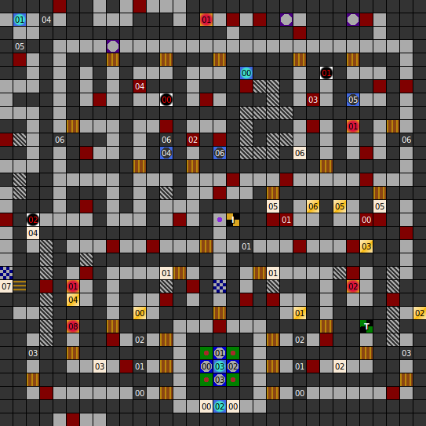

Internal map ID: __0__

### Map

### Key

### Questions

* Question 00: "A" (En); "A" (De) _(Unused)_
* Answer 00: A (En); A (De) _(Unused)_

### Messages

* 00: BAEM ME UP, SCOTTY! (En);
  BEAM ME UP, SCOTTY! (De)
* 01: A TREASURE! SEARCH FOR IT. (En);
  VORSICHT, EIN SCHATZ IST IN DER N&Auml;HE! (De)
* 02: THE PATH OF HEALING. ONLY FOR HEROS WITH MONEY. (En);
  DER WEG ZUR HEILUNG. NUR F&Uuml;R LEUTE MIT FETTEM GELDBEUTEL! (De)
* 03: THE PATH OF DEATH. ONLY FOR FOOLS. (En);
  DER WEG ZUM TOD. WENN MAN M&Ouml;CHTE! (De)
* 04: PRISONCELLS: VISITORS NOT ALLOWED. (En);
  GEF&Auml;NGNISTRACKT. BESUCHSZEITEN:  12-14 UHRxhNUR MIT BESUCHERSCHEIN. (De)
* 05: THE ROOM OF THE GUARDIANS. ENTER IF YOU ARE A GUARDIAN. (En);
  QUARTIER DER WACHEN. EINTRITT NUR F&Uuml;R WACHEN ERLAUBT. (De)
* 06: "SCOTTY WAS HERE.", IS ETCHED ON THIS WALL. (En);
  DER SATZ: "SCOTTY WAS HERE", IST IN DIE WAND EINGERITZT. (De)
* 07: 2. LEVEL:  TROLLS,DRAGONS,SLIMERS,            UNDERWEAR... (En);
  2\. ETAGE:  TROLLE,DRACHEN,GNOME,            DAMENUNTERW&Auml;SCHE... (De)
* 08: _(Empty)_ (En),
  "................................ ................................" (De)
  _(Unused)_

### Chests

* 00: Wood Shield, Unidentified Arrows, Helmet
* 01: Sword, Dagger, 40 Gold, Unidentified Permission
* 02: 40 Gold, Killmagic, Warhammer
* 03: 80 Gold, Buckler, Helmet, Killmagic, Killmagic, Killmagic
* 04: Arrows, Knight Armour, Unidentified Longbow, Killmagic
* 05: Battle Axe, Unidentified Warstaff, Wood Shield, Killmagic
* 06: Arrows, Unidentified Wasp Sting, Sword, Wasp Sting, Killmagic, Killmagic

### Notes

Prev: [&laquo; Map: Dungeon of Isla (DoA2), level 0](doa2-dungeon0.html)

Next: [Map: Dungeon of Isla (DoA2), level 2 &raquo;](doa2-dungeon2.html)
