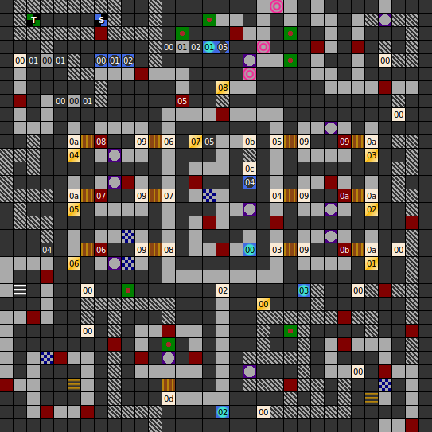

Internal map ID: __1__

### Map

### Key

### Questions

* Question 00: "A" (En); "A" (De) _(Unused)_
* Answer 00: A (En); A (De) _(Unused)_

### Messages

* 00: DEATH END. (En);
  SACKGASSE! (De)
* 01: NEAR! (En);
  N&Auml;HE! (De) _(Unused)_
* 02: HALL OF THE 7 DEATH KINGS. LET THEM REST IN PEACE AND THEY WILL LET YOU ALIVE. (En);
  HALLE DER 7 TOTEN K&Ouml;NIGE. LASST UNS RUHEN,UND WIR WERDEN  EUCH NICHTS TUEN. (De)
* 03: ON THE TOMBSTONE IS ETCHED: KING LEANDER OF AVALON. (En);
  HIER RUHEN DIE &Uuml;BERRESTE VON: K&Ouml;NIG LEANDER VON AVALON. (De)
* 04: ON THE TOMBSTONE IS ETCHED: KING RAGT OF AVALON AND ISODOR. (En);
  HIER RUHEN DIE &Uuml;BERRESTE VON: K&Ouml;NIG RAGT VON AVALON UND ISODOR. (De)
* 05: ON THE TOMBSTONE IS ETCHED: KING WALTER OF 2D AND CT. (En);
  HIER RUHEN DIE &Uuml;BERRESTE VON: K&Ouml;NIG WALTER VON 2D UND CT. (De)
* 06: ON THE TOMBSTONE IS ETCHED: PRICE LEAN OF AVALON AND ISODOR. (En);
  HIER RUHEN DIE &Uuml;BERRESTE VON: PRINZ LEAN VON AVALON UND ISODOR. (De)
* 07: ON THE TOMBSTONE IS ETCHED: QUEEN LISS OF AVALON AND THE ISLE RACHON. (En);
  HIER RUHEN DIE &Uuml;BERRESTE VON: K&Ouml;NIGIN LISS VON AVALON UND DER INSEL RACHON. (De)
* 08: ON THE TOMBSTONE IS ETCHED: QUEEN SCHAN OF AVALON AND ISODOR. (En);
  HIER RUHEN DIE &Uuml;BERRESTE VON: K&Ouml;NIGIN SHAN VON AVALON UND ISODOR. (De)
* 09: THIS GRAVE IS ILLUMINATED BY A RED LIGHT.IT'S VERY  STRANGE HERE. (En);
  DIESE GRUFT IST UNHEIMLICH. EIN ROTES LICHT BELEUCHTET DIE  W&Auml;NDE AUF SELTSAME WEISE. (De)
* 0A: TAKE MY TREASURE AND I'LL TAKE YOUR LIVE. (En);
  NIMM MEINEN SCHATZ, UND ICH NEHME DEIN LEBEN! (De)
* 0B: ON THE TOMBSTONE IS ETCHED: KING MITHOS OF AVALON AND THE ISLE RACHON. (En);
  HIER RUHEN DIE &Uuml;BERRESTE VON: K&Ouml;NIG MITHOS VON AVALON UND DER INSEL ISODOR. (De)
* 0C: THIS GRAVE SEEMS TO BE PLUNDERT. (En);
  DIESE GRABKAMMER SCHEINT SCHON GEPL&Uuml;NDERT ZU SEIN. (De)
* 0D: I HOPE THAT YOUR COURAGE WANT LEAVE YOU YET. (En);
  ICH HOFFE DER MUT VERL&Auml;&szlig;T EUCH NICHT..... (De)

### Chests

* 00: Chest, Unidentified Healing Potion (HP), Healing Potion (Pois), Arrows
* 01: (Acid trap), 100 Gold
* 02: (Acid trap), 100 Gold
* 03: (Acid trap), 100 Gold
* 04: (Acid trap), 100 Gold
* 05: (Acid trap), 100 Gold
* 06: (Acid trap), 100 Gold, Chest
* 07: 500 Gold, Arc's Helmet, Ara's Armour, Bee-Ring, Dragonstone, Silver-Ring
* 08: (Empty)

### Fixed monster encounters

* 05: 5x Big Frog, 3x Pest Baby
* 06: 3x Werewolf
* 07: 5x Werewolf
* 08: 3x Werewolf
* 09: 2x Werewolf
* 0a: 4x Werewolf
* 0b: 2x Werewolf

### Notes

* Map looping first becomes evident on this level, although it's easy to miss.
  The section at teleporter 03 uses looping, but it's isolated from the rest
  of the map and it's not necessarily evident that looping is occurring.
  The tunnel of secret doors heading south at the left of the map allows the
  player to loop indefinitely.
* Message 00 should read "Dead End".
* The English translation says King Mithos was king of the Isle
  Rachon, while in German he was king of the Isle Isodor.
  Isodor is not described as an isle on other tombstones.
* German spells the Queen's name "Schan", but in English it's "Shan".
* All trapped chests in _Dungeons of Avalon II_ have acid trap, although other
  types do appear in the game code.
* "2D" may be a reference to Double Density, a Commodore 64 demoscene group of
  which _Dungeons of Avalon_ coder Hakan Akibiyik was a member.
* Pay attention to the names of Prince Lean and Queen Liss.
  They're puzzle answers later.

Prev: [&laquo; Map: Dungeon of Isla (DoA2), level 1](doa2-dungeon1.html)

Next: [Map: Dungeon of Isla (DoA2), level 3 &raquo;](doa2-dungeon3.html)
