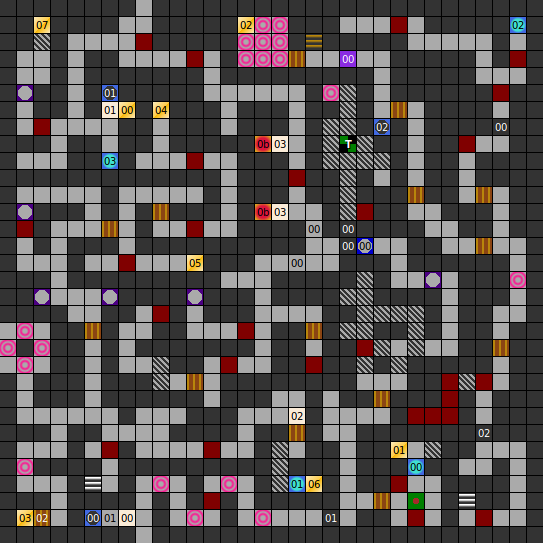

Internal map ID: __2__

### Map

### Key

### Questions

* Question 00: "TELL ME THE NAME OF THE PRINCE OF AVALON AND ISODOR" (En);
  "WIE IST DER NAME DES PRINZEN    VON AVALON UND ISODOR?" (De)
* Answer 00: LEAN (En);
  LEAN (De)

### Messages

* 00: "OTHER SITCH!" (En);
  "ANDERER SCHALTER!" (De)
* 01: SEARCH FOR THE "OTHER SWITCH!" THEN RETURN TO FINISH. (En);
  SUCHE ZUERST DEN ANDEREN SCHALTER,ERST DANN KOMMST DU WEITER. (De)
* 02: TELEPORTER ROOM. USE OF OWN RISK. (En);
  TELEPORTER RAUM. BENUTZUNG AUF EIGEN GEFAHR. (De)
* 03: DANGER, FALLING STONES. (En);
  ACHTUNG, STEINSCHLAG! (De)

### Chests

* 00: Birds View, Eagles View, Restoration
* 01: Levitation, Levitation, Crossbow
* 02: Spellbook, Spellbook, Warhammer, Mace, Elf Arrows
* 03: (Acid trap), Healing Potion (Pois)
* 04: Restone, 500 Gold
* 05: 240 Gold
* 06: Levitation, Healing II
* 07: Healing II, Levitation

### Notes

* This map loops North-South at one point.

Prev: [&laquo; Map: Dungeon of Isla (DoA2), level 2](doa2-dungeon2.html)

Next: [Map: Dungeon of Isla (DoA2), level 4 &raquo;](doa2-dungeon4.html)
