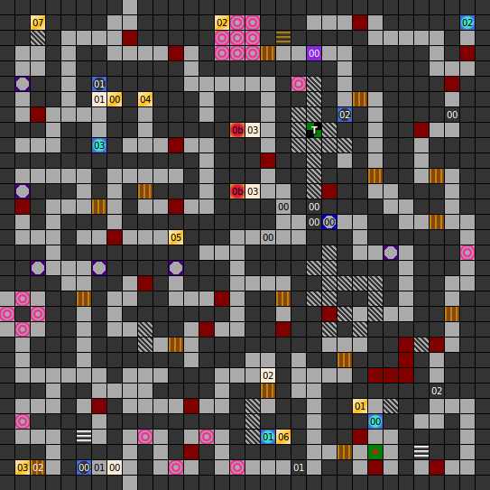

Internal map ID: __2__

Flee chance: 13/16 (81.25%)

### Map

### Key

### Teleporters

| ID | Coords      | Target | Coords      |
|----|-------------|--------|-------------|
| 00 | X: 30 Y: 01 |     02 | X: 24 Y: 27 |
| 01 | X: 06 Y: 09 |     03 | X: 17 Y: 28 |
| 02 | X: 24 Y: 27 |     00 | X: 30 Y: 01 |
| 03 | X: 17 Y: 28 |     01 | X: 06 Y: 09 |

Number shown on map is the target teleporter ID. All teleporters on this level
are bi-directional.

### Questions

* Question 00: "TELL ME THE NAME OF THE PRINCE OF AVALON AND ISODOR" (En);
  "WIE IST DER NAME DES PRINZEN    VON AVALON UND ISODOR?" (De)
* Answer 00: LEAN (En);
  LEAN (De)

### Messages

* 00: "OTHER SITCH!" (En);
  "ANDERER SCHALTER!" (De)
* 01: SEARCH FOR THE "OTHER SWITCH!" THEN RETURN TO FINISH. (En);
  SUCHE ZUERST DEN ANDEREN SCHALTER,ERST DANN KOMMST DU WEITER. (De)
* 02: TELEPORTER ROOM. USE OF OWN RISK. (En);
  TELEPORTER RAUM. BENUTZUNG AUF EIGEN GEFAHR. (De)
* 03: DANGER, FALLING STONES. (En);
  ACHTUNG, STEINSCHLAG! (De)

### Chests

* 00: Birds View, Eagles View, Restoration
* 01: Levitation, Levitation, Crossbow
* 02: Spellbook, Spellbook, Warhammer, Mace, Elf Arrows
* 03: (Acid trap), Healing Potion (Pois)
* 04: Restone, 500 Gold
* 05: 240 Gold
* 06: Levitation, Healing II
* 07: Healing II, Levitation

### Random monster encounters

* 1-3 groups of 1-3 Werewolf, Invisible, or Voodoo Man

### Monster statistics

| Name            |  HP | Damage  | Atk |SpAtk|Stat|    XP |Gold |
|-----------------|-----|---------|-----|-----|----|-------|-----|
| Invisible       |  29 |   15-18 |   4 |   7 | BL |   176 |  25 |
| Voodoo Man      |  30 |   19-22 |   5 |   4 |    |   196 |  50 |
| Werewolf        |  32 |   20-23 |   4 |   4 | PO |   208 |  20 |

* Werewolf can cast Flame Tonge (6-11 damage to one target).
* Voodoo Man can cast Flame Sword (9-17 damage to one target).

### Notes

* This map loops North-South at one point.

Prev: [&laquo; Map: Dungeon of Isla (DoA2), level 2](doa2-dungeon2.html)

Next: [Map: Dungeon of Isla (DoA2), level 4 &raquo;](doa2-dungeon4.html)
