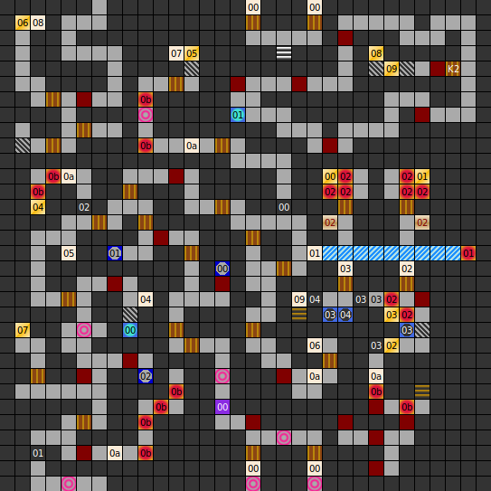

Internal map ID: __3__

### Map

### Key

### Questions

* Question 00: "TELL ME THE NAME OF THE QUEEN OF AVALON AND THE ISLE RACHON" (En);
  "WIE IST DER NAME DER K&Ouml;NIGIN VON AVALON UND INSEL RACHON?" (De)
* Answer 00: LISS (En);
  LISS (De)

### Messages

* 00: OOOPS! (En);
  OOOPS! (De)
* 01: ON THE WALL IS ETCHED: fENTER OF OWN RISK. (En);
  AUF EINEM TAFEL STEHT: fBETRETEN AUF EIGENE GEFAHR! (De)
* 02: ON THE WALL IS ETCHED: PRIVATE ROOM OF THE PRINCE. DON'T ENTER. (En);
  AUF DER WAND STEHT: PRIVATZIMMER DES PRINZEN! AUFENTHALT AUF TODESSTRAFE UNTERSAGT. (De)
* 03: ON THE WALL IS ETCHED: TOYROOM OF THE PRINCE. (En);
  NEBEN DER T&Uuml;R STEHT: SPIELZIMMER DES PRINZEN! (De)
* 04: THE FIRST WORD IS NOT WRONG. (En);
  DAS ERSTE WORT IST NICHT FALSCH! (De)
* 05: THE SECOND WORD IS NOT GREAT. (En);
  DAS ZWEITE WORT IST NICHT GRO&szlig;! (De)
* 06: THE THIRD WORD IS NOT EVIL. (En);
  DAS DRITTE WORT IST NICHT B&Ouml;SE! (De)
* 07: THE FOURTH WORD IS NOT STUPID. (En);
  DAS VIERTE WORT IST NICHT DUMM! (De)
* 08: THE FIFTH WORD IS NOT COLD. (En);
  DAS F&Uuml;NFTE WORT IST NICHT KALT! (De)
* 09: FIVE WORD ARE THE KEY. IF YOU GOT THEM ALL  ONLY THEN YOU SHOULD LEAVE THIS HALL. (En);
  F&Uuml;NF W&Ouml;RTER SIND DER SCHL&Uuml;SSEL NUR WENN DU HAST ALLE, SOLTEST DU VERLASSEN DIESE HALLE! (De)
* 0A: DANGER, FALLING STONES. (En);
  ACHTUNG, STEINSCHLAG! (De)

### Chests

* 00: Levitation, Unidentified Magic Eye, Eagles View, Healing Potion (Pois), Chest, Antipoisen
* 01: Magic Armour, Ice Breath, Antipoisen, Restoration, Bee-Ring, Longbow
* 02: Silver-Ring, New Live, Unidentified Fire Shield, Scroll 1, Healing Potion (HP), Healing Potion (HP)
* 03: (Empty)
* 04: 500 Gold
* 05: (Unlocked): 200 Gold
* 06: 240 Gold
* 07: Chest, Chest
* 08: (Unlocked): Killersword, Unidentified Magic Armour, Eagles View, Arc's Boolas, Battle Helmet, Power Helmet
* 09: Buckler, Buckler, Armour, Knight Armour, Unidentified Bolas, Elf Arrows

### Notes

* Scroll 1 reads:
  * "LORD ROA IS THE SON OF THE DARK LORD"   (en)
  * "LORD ROA IST DER SOHN DES DRAK LORD'S." (De)

Prev: [&laquo; Map: Dungeon of Isla (DoA2), level 3](doa2-dungeon3.html)

Next: [Map: Dungeon of Isla (DoA2), level 5 &raquo;](doa2-dungeon5.html)
