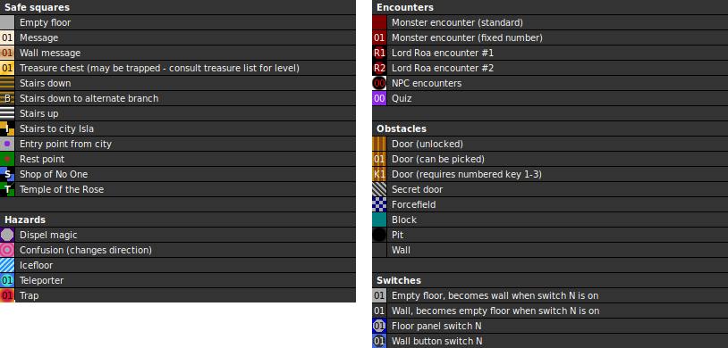

Internal map ID: __4__

### Map

### Key

### Questions

* Question 00: "TELL ME WHAT IS NOT WRONG ?" (En);
  "WAS IST NICHT FALSCH ?" (De)
* Answer 00: RIGHT (En);
  RICHTIG (De)
^
* Question 01: "TELL ME WHAT IS NOT GREAT ?" (En);
  "WAS IST NICHT GRO&szlig; ?" (De)
* Answer 01: SMALL (En);
  KLEIN (De)
^
* Question 02: "TELL ME WHAT IS NOT EVIL ?" (En);
  "WAS IST NICHT B&Ouml;SE ?" (De)
* Answer 02: GOOD (En);
  GUT (De)
^
* Question 03: "TELL ME WHAT IS NOT STUPID ?" (En);
  "WAS IST NICHT DUMM ?" (De)
* Answer 03: CLEVER (En);
  KLUG (De)
^
* Question 04: "TELL ME WHAT IS NOT COLD ?" (En);
  "WAS IST NICHT KALT ?" (De)
* Answer 04: WARM (En);
  WARM (De)

### Messages

* 00: THE HALL OF SWITCHES! SWITCH ONLY BY PLAN. (En);
  HALLE DER SCHALTER! SCHALTE MIT BEDACHT ODER NACH ANLEITUNG! (De)
* 01: DANGER FALLING STONES. (En);
  ACHTUNG, STEINSCHLAG! (De)
* 02: LOOKS IT NOT VERY SIMILAR HERE! (En);
  KOMMT EUCH DENN DAS NICHT SCHON  BEKANNT VOR?? (De)
* 03: THE FIRST  SWITCH. (En);
  AUF DER WAND STEHT: SCHALTER 1 (De)
* 04: THE SECOND SWITCH. (En);
  AUF DER WAND STEHT: SCHALTER 2 (De)
* 05: THE THIRD  SWITCH. (En);
  AUF DER WAND STEHT: SCHALTER 3 (De)
* 06: THE FOURTH SWITCH. (En);
  AUF DER WAND STEHT: SCHALTER 4 (De)
* 07: SEARCH FIRST FOR THE DRAGONSTONE ONLY WITH IT YOU'LL BREAK THE SPELL. (En);
  FINDE DEN DRACHENSTEIN, ERST DANN KANNST DU HEIM! (De)
* 08: THE FIRST PATH LEADS TO RICHNESS. (En);
  DER ERSTE WEG F&Uuml;HRT ZU REICHTUM. (De)
* 09: THE SECOND PATH LEADS TO WEAPONS. (En);
  DER ZWEITE WEG F&Uuml;HRT ZU WAFFEN. (De)
* 0A: THE THIRD PATH LEADS TO THE KEY. (En);
  DER DRITTE WEG F&Uuml;HRT ZUM SCHL&Uuml;SSEL. (De)
* 0B: TREASUREROOM. (En);
  SCHATZKAMMER! (De)

### Chests

* 00: (Empty)
* 01: Dragonfigure, Antipoisen, Healing Potion (HP), Stemberfang, Arc's Boolas, Arc's Speer
* 02: Key 2, Key 2, Key 2, Key 2, Scroll 2
* 03: Healing II, Healing II, Eaglefang, Eaglefang
* 04: 2000 Gold
* 05: (Unlocked): Ara's Shield, Metal Shield, Kel's Crossbow, Arrows, Arrows, Stone-Ring, Helmet, Sefer's Helmet
* 06: Healing Robe, Deathbringer, Robe, Arc's Helmet, Arc's Axe, Arc's Sword, Restone
* 07: 40 Gold, Mace
* 08: (Acid trap), Broadsword
* 09: (Unlocked): Healing Potion (HP), Healing Potion (HP), Restone, 200 Gold, Magic Eye
* 0A: Healing Potion (HP), Healing Potion (HP), Restone, 200 Gold, Magic Eye

### Notes

* Scroll 2 reads:
  * FIRST  PATH : 1010 SECOND PATH : 1101 THIRD  PATH : 0101  SWITCH THIS COMBINATION FOR THE CHOOSEN PATH...  (En)
  * ERSTER WEG  : 1010 ZWEITER WEG : 1101 DRITTER WEG : 0101  STELLE DIESE KOMBINATIONEN EIN UND DER WEG WIRD SICH &Ouml;FFNEN...  (De)
* Scroll 3 doesn't appear in the game, but it just reads "TEXT2". Scroll 4 was
  replaced with the item Permission.
* You can return to the city from this level, but when you re-enter the dungeon
  you'll start again at the first dungeon level.
* This is the lowest dungeon level.
* An interesting quirk is that every empty chest in this level is internally the
  same chest. There are 11 instances of the same chest 00.

Prev: [&laquo; Map: Dungeon of Isla (DoA2), level 4](doa2-dungeon4.html)

Next: [Map: Tower of Roa (DoA2), level 1 &raquo;](doa2-tower1.html)
