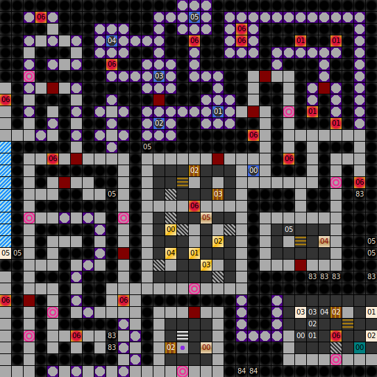

Internal map ID: __8__

### Map

### Key

### Questions

* Question 00: "A" (En); "A" (De) _(Unused)_
* Answer 00: A (En); A (De) _(Unused)_

### Messages

* 00: FIND FIRS ALL SIX,THAN GO GO DOWN. (En);
  FINDE ALLE 6, DANN ERST GEHE RUNTER. (De)
* 01: AN THE BBOARD IS WRITTEN: LORD ROA IS THE GREATEST. (En);
  HIER AUF DER TAFEL STEHT: LORD ROA IST DER G&Ouml;&szlig;TE. (De)
* 02: THE ABYSS IS A SHORT-CUT... (En);
  DIE SCHLUCHT IST EINE ABK&Uuml;RZUNG... (De)
* 03: ...TO THE DEATH. (En);
  ...IN DEN TOD. (De)
* 04: LORD ROA WAS HERE! (En);
  LORD ROA WAS HERE! (De)
* 05: HERE THEY ARE,THE SIX. (En);
  HIER SIND SIE ALLE 6. (De)
* 06: I HOPE THAT WAS NOT SO FRIGHTENED FOR YOU..  LORD ROA. (En);
  NA HABT IHR EUCH ERSCHRECKT!  LORD ROA. (De)

### Chests

* 00: Key 1, Key 1
* 01: Key 1
* 02: (Acid trap), Key 1
* 03: Key 1
* 04: Key 1

### Notes

Prev: [&laquo; Map: Tower of Roa (DoA2), level 3](doa2-tower3.html)

Next: [Map: Tower of Roa (DoA2), level B2 &raquo;](doa2-tower-b2.html)
