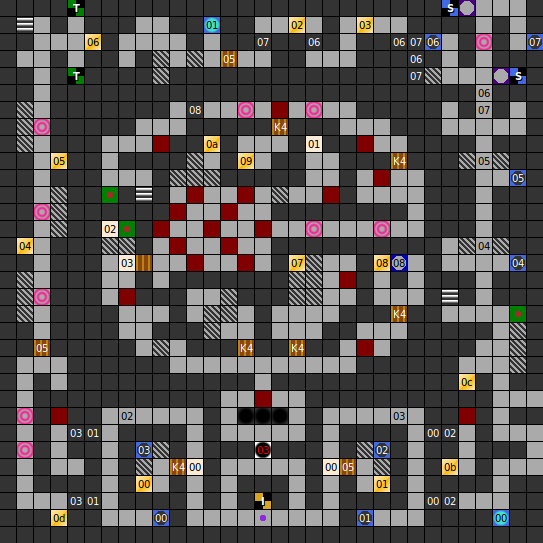

Internal map ID: __5__

### Map

### Key

### Questions

* Question 00: "A" (En); "A" (De) _(Unused)_
* Answer 00: A (En); A (De) _(Unused)_

### Messages

* 00: MAPROOM OF ISLA. (En);
  KARTENRAUM VON ISLA. (De)
* 01: LORD ROA IS THE SON OF THE DARK LORD. (En);
  LORD ROA IST DER SOHN DES DARK LORD'S (De)
* 02: LORD ROA GOT NOT ONLY THE EVILNESS OF HIS FATHER HE GOT HIS ANTIAURA TOO. (En);
  LORD ROA HAT NICHT NUR DIE BOSHAFTIGKEIT SEINES VATERS GEERBT, SONDERN AUCH DESSEN ANTI-MAGIE AURA. (De)
* 03: ROOM OF THE GUARDIANS. (En);
  RAUM DER WACHEN. (De)

### Chests

* 00: Birds View, Birds View
* 01: Flint, Magic Eye
* 02: (Unlocked): Healing Potion (HP), Killersword, Kel's Arrows
* 03: Deadly Flash, Deadly Flash, New Live, Crossbow
* 04: Key 4, Key 4, 100 Gold
* 05: (Unlocked): Key 4, Key 4, Key 4, 200 Gold
* 06: Restoration, 200 Gold, Fire Shield
* 07: Stone-Ring, Healing Robe, Power Helmet
* 08: Silver-Ring, Ara's Armour, 40 Gold
* 09: (Unlocked): Kel's Arrows, Battle Helmet, 40 Gold
* 0A: Deadly Flash, Anti-Aura, Deadly Flash
* 0B: Levitation, 40 Gold, Bee-Ring
* 0C: Levitation, 40 Gold
* 0D: Levitation, 40 Gold

### NPC encounters (English)

03:

> STOP!  I'M THE OWNER OF THIS PASSAGE.IF YOU WILL USE MY PASSAGE YOU MUST PAYE
> ME A TOLL.THIS TOLL IS A DRAGON. GIVE IT TO ME AND YOU CAN PASS
^
> OH,THIS IS A FINE FIGURINE. IT WILL FIT TO MY COLLECTION OF  MINI DRAGONS. YOU
> CAN PASS.

### NPC encounters (German)

03:

> HALT!  ICH BIN DER RIESE ARGHA. DAS HIER IST MEINE PASSAGE. WENN IHR HIER
> DURCH WOLLT,M&Uuml;SST IHR MIR ALS WEGZOLL EINEN DRACHEN GEBEN. OHNE DRACHE
> KEIN WEITERKOMMEN..
^
> OH,IST ABER EIN SCH&Ouml;NER DRACHE! SO EINER HATTE MIR IN MEINER SAMMLUNG
> NOCH GEFEHLT.  IHR K&Ouml;NNT JETZT WEITER.

### Notes

* This is the only level in the game which requires Key 4, and the only level
  which dispenses Key 4 in chests.
  Six doors require Key 4, but only five Key 4 are given in chests.
  The first, which is necessary to unlock the Map Room of Isla,
  is given by the Thieves Rabun in exchange for an antipoison.
  The switch in this room opens the western route leading to chests 4
  and 5, which contain the five other Key 4s.
* Since the first _Dungeons of Avalon_ doesn't require Key 4 (although it does
  give one in a treasure chest), this is in fact the only level in the
  entire series which requires Key 4.
* Message 02 on this level has the same translation problem as the first
  _Dungeons of Avalon_, where the Dark Lord's aura is referred to as an
  "Anti-Aura", which is actually the name of the spell that counters his
  aura. In German here Lord Roa's power is referred to as to as an antimagic
  aura.

Prev: [&laquo; Map: Dungeon of Isla (DoA2), level 5](doa2-dungeon5.html)

Next: [Map: Tower of Roa (DoA2), level 2 &raquo;](doa2-tower2.html)
