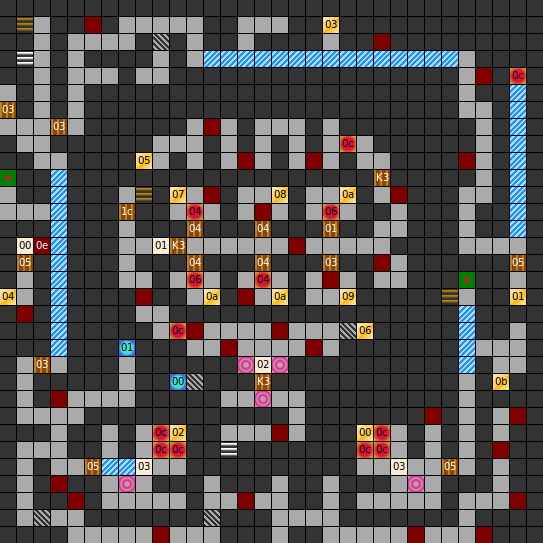

Internal map ID: __6__

### Map

### Key

### Questions

* Question 00: "A" (En); "A" (De) _(Unused)_
* Answer 00: A (En); A (De) _(Unused)_

### Messages

* 00: THIS IS THE GRAVE OF: ZELS THE KING OF THIEVES. (En);
  GRABKAMMER VON ZELS, DEM K&Ouml;NIG DER DIEBE. (De)
* 01: TREASUREROOM. ENTER OF OWN RISK. (En);
  SCHATZKAMMER. BETRETEN STRENGSTENS UNTERSAGT. (De)
* 02: THE PRIVATE ROOMS OF LOR ROA. (En);
  ZU DEN PRIVATR&Auml;UMEN LORD ROA'S. (De)
* 03: DANGER! (En);
  ACHTUNG! (De)

### Chests

* 00: Key 3, 20 Gold, New Live
* 01: Key 3, 20 Gold, Magic Armour
* 02: (Unlocked): Key 3, 20 Gold, Magic Armour
* 03: Dagger
* 04: Rahven, 40 Gold, Unidentified Broadsword, Sword, Warhammer
* 05: (Unlocked): 240 Gold, Battle Axe
* 06: 200 Gold, Battle Axe
* 07: (Acid trap), 200 Gold, Warhammer
* 08: (Unlocked): 200 Gold, Warhammer
* 09: 200 Gold
* 0A: Dagger _(Appears 3 times)_
* 0B: 40 Gold

### Notes

* Chest 0A, which contains a dagger, actually appears three times.
  This means that once you take the dagger from one of the chests,
  the other two suddenly become empty. This is because the game treats them as
  separate instances of the same chest, rather than separate chests.
* This is the only level in the game which requires Key 3.
  Exactly 3 Key 3s appear in chests in the game, all on this level,
  and there are 3 doors which require it, all on this level.

Prev: [&laquo; Map: Tower of Roa (DoA2), level 1](doa2-tower1.html)

Next: [Map: Tower of Roa (DoA2), level 3 &raquo;](doa2-tower3.html)
