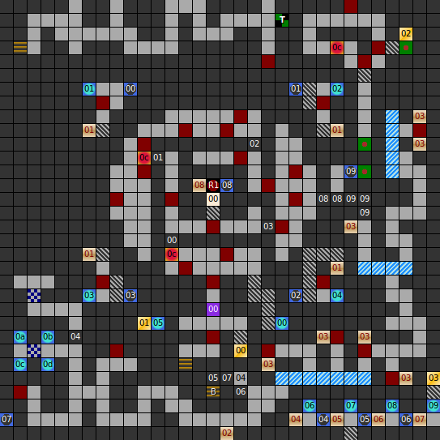

Internal map ID: __7__

### Map

### Key

### Questions

* Question 00: "TELL ME THE NAME OF LORD ROA'S FATHER." (En);
  "NEMME MIR DEN NAMEN DES VATERS VON LORD ROA!" (De)
* Answer 00: DARK LORD (En);
  DARK LORD (De)

### Messages

* 00: ARE YOU READY TO FACE THE EVIL ONE. (En);
  MACHT EUCH BEREIT DEM TOD INS GESICHT ZU SEHEN. (De)
* 01: AT THE BOARD IS WRITTEN: SWITCH! (En);
  AUF DER TAFEL STEHT:SCHALTER! (De)
* 02: DOWN TO THE ABYSS. (En);
  ABW&Auml;RTS IN DIE KATAKOMBEN. (De)
* 03: DEATH END. (En);
  SACKGASSE! (De)
* 04: OFF! ON! (En);
  AUS! AN! (De)
* 05: ON! (En);
  AN! (De)
* 06: ON! (En);
  AN! (De)
* 07: ON! (En);
  AN! (De)
* 08: WAS IT NOT FUNNY TO BATTLE AGAINST MY ILLUSION! LORD ROA. (En);
  HAT ES DENN SPASS GEMACHT, GEGEN MEINE ILLUSION ZU K&Auml;MPFEN?? LORD ROA. (De)

### Chests

* 00: Bolas, Firedagger, Chest, Robe
* 01: Battle Axe, Warstaff, Deadly Flash, Healing Robe
* 02: Killmagic, Deadly Flash
* 03: Killmagic, Deadly Flash

### Fixed monster encounters

* 0f: Lord Roa #1, Arc Dragon, Skelleton (fake Lord Roa)

### Notes

* This is the top level of the tower. There are no stairs upward on this level.
  However, the southernmost set of stairs downward (marked on the map with a B)
  leads to a new branch of the dungeon, which I've referred to as B1. This is
  the "next" level. Below that is B2.
* This is the only level of the series where two sets of stairs lead to different
  levels.
* The fake Lord Roa is internally a different creature to the real Lord Roa.
* This map loops North-South at one point, but the section is enclosed so it's
  not obvious.

Prev: [&laquo; Map: Tower of Roa (DoA2), level 2](doa2-tower2.html)

Next: [Map: Tower of Roa (DoA2), level B1 &raquo;](doa2-tower-b1.html)
