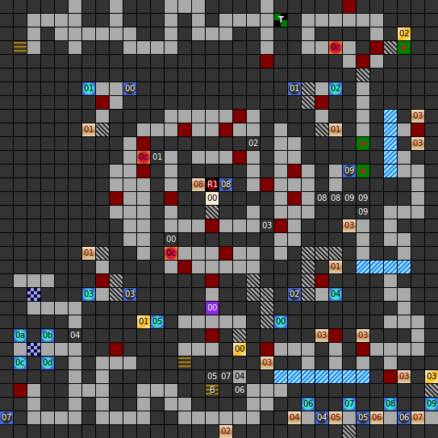

Internal map ID: __7__

Flee chance:  8/16  50.00%

### Map

### Key

### Teleporters

| ID | Coords      | Target | Coords      |
|----|-------------|--------|-------------|
| 00 | X: 06 Y: 06 |     01 | X: 24 Y: 06 |
| 01 | X: 24 Y: 06 |     02 | X: 06 Y: 21 |
| 02 | X: 06 Y: 21 |     03 | X: 24 Y: 21 |
| 03 | X: 24 Y: 21 |     04 | X: 11 Y: 23 |
| 04 | X: 11 Y: 23 |     05 | X: 20 Y: 23 |
| 05 | X: 20 Y: 23 |     00 | X: 06 Y: 06 |
| 06 | X: 01 Y: 24 |     0A | X: 22 Y: 29 |
| 07 | X: 03 Y: 24 |     0B | X: 25 Y: 29 |
| 08 | X: 01 Y: 26 |     0C | X: 28 Y: 29 |
| 09 | X: 03 Y: 26 |     0D | X: 31 Y: 29 |
| 0A | X: 22 Y: 29 |     06 | X: 01 Y: 24 |
| 0B | X: 25 Y: 29 |     07 | X: 03 Y: 24 |
| 0C | X: 28 Y: 29 |     08 | X: 01 Y: 26 |
| 0D | X: 31 Y: 29 |     09 | X: 03 Y: 26 |

Number shown on map is the target teleporter ID.

### Questions

* Question 00: "TELL ME THE NAME OF LORD ROA'S FATHER." (En);
  "NEMME MIR DEN NAMEN DES VATERS VON LORD ROA!" (De)
* Answer 00: DARK LORD (En);
  DARK LORD (De)

### Messages

* 00: ARE YOU READY TO FACE THE EVIL ONE. (En);
  MACHT EUCH BEREIT DEM TOD INS GESICHT ZU SEHEN. (De)
* 01: AT THE BOARD IS WRITTEN: SWITCH! (En);
  AUF DER TAFEL STEHT:SCHALTER! (De)
* 02: DOWN TO THE ABYSS. (En);
  ABW&Auml;RTS IN DIE KATAKOMBEN. (De)
* 03: DEATH END. (En);
  SACKGASSE! (De)
* 04: OFF! ON! (En);
  AUS! AN! (De)
* 05: ON! (En);
  AN! (De)
* 06: ON! (En);
  AN! (De)
* 07: ON! (En);
  AN! (De)
* 08: WAS IT NOT FUNNY TO BATTLE AGAINST MY ILLUSION! LORD ROA. (En);
  HAT ES DENN SPASS GEMACHT, GEGEN MEINE ILLUSION ZU K&Auml;MPFEN?? LORD ROA. (De)

### Chests

* 00: Bolas, Firedagger, Chest, Robe
* 01: Battle Axe, Warstaff, Deadly Flash, Healing Robe
* 02: Killmagic, Deadly Flash
* 03: Killmagic, Deadly Flash

### Random monster encounters

* 1-5 groups of 1-6 Skelleton, Guardian, or Magician

### Fixed monster encounters

* 0f: Lord Roa (fake), Arc Dragon, Skelleton

### Monster statistics

| Name            |  HP | Damage  | Atk |SpAtk|Stat|    XP |Gold |
|-----------------|-----|---------|-----|-----|----|-------|-----|
| Arc Dragon      |  75 |   40-43 |   7 |   7 |    |   460 |  50 |
| Guardian        |  99 |   15-18 |   7 |   8 |    |   456 |  35 |
| Lord Roa        | 256 | 100-103 |  20 |  20 |    | 1,424 | 128 |
| Magician        |  30 |   15-18 |   9 |   8 |    |   180 |  10 |
| Skelleton       |  95 |   30-33 |   7 |   7 | PO |   500 |  75 |

* Arc Dragon can cast Firefist (14-20 damage to one target).

### Notes

* This is the top level of the tower. There are no stairs upward on this level.
  However, the southernmost set of stairs downward (marked on the map with a B)
  leads to a new branch of the dungeon, which I've referred to as B1. This is
  the "next" level. Below that is B2.
* This is the only level of the series where two sets of stairs lead to different
  levels.
* The fake Lord Roa is internally a different creature to the real Lord Roa.
* This map loops North-South at one point, but the section is enclosed so it's
  not obvious.
* This level has the most teleporters of any in the series (13).
* Magician can't cast any spells.

Prev: [&laquo; Map: Tower of Roa (DoA2), level 2](doa2-tower2.html)

Next: [Map: Tower of Roa (DoA2), level B1 &raquo;](doa2-tower-b1.html)
