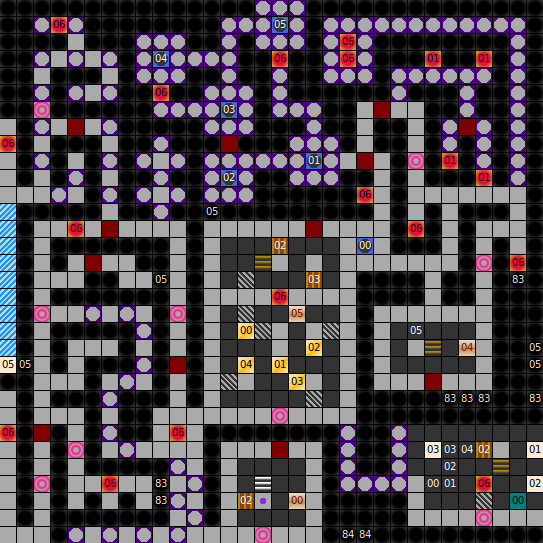

Internal map ID: __8__

### Map

### Key

### Questions

* Question 00: "A" (En); "A" (De) _(Unused)_
* Answer 00: A (En); A (De) _(Unused)_

### Messages

* 00: FIND FIRS ALL SIX,THAN GO GO DOWN. (En);
  FINDE ALLE 6, DANN ERST GEHE RUNTER. (De)
* 01: AN THE BBOARD IS WRITTEN: LORD ROA IS THE GREATEST. (En);
  HIER AUF DER TAFEL STEHT: LORD ROA IST DER G&Ouml;&szlig;TE. (De)
* 02: THE ABYSS IS A SHORT-CUT... (En);
  DIE SCHLUCHT IST EINE ABK&Uuml;RZUNG... (De)
* 03: ...TO THE DEATH. (En);
  ...IN DEN TOD. (De)
* 04: LORD ROA WAS HERE! (En);
  LORD ROA WAS HERE! (De)
* 05: HERE THEY ARE,THE SIX. (En);
  HIER SIND SIE ALLE 6. (De)
* 06: I HOPE THAT WAS NOT SO FRIGHTENED FOR YOU..  LORD ROA. (En);
  NA HABT IHR EUCH ERSCHRECKT!  LORD ROA. (De) _(Unused)_

### Chests

* 00: Key 1, Key 1
* 01: Key 1
* 02: (Acid trap), Key 1
* 03: Key 1
* 04: Key 1

### Notes

* This is the only level in the game where Key 1 appears in chests. There are
  six such keys.
* This is the only map to utilize East-West looping. It also loops North-South
  at one point. The heavy use of antimagic squares (148 on this level, more than
  the entire rest of the _Dungeons of Avalon_ series combined) impedes the use
  of mapping spells, making it difficult to notice this.
* Several messages appear to be in incorrect positions:
  * Message 1 says "On the board is written", but only messages 0, 4 and 5 are
  written on walls.
  * Message 2 and 3 would make more sense in positions 01 and 02.
  * Message 6 is not used. It seems likely that it was intended to take the
  place of #5 at the end of the ice slide.
* "Find all 6" here may refer to two things: the six Key 1 appearing in chests
  in the middle, or all six buttons which unlock the stairways down.
* There are three stairs down here:
  * The central stairs near the chest is hidden only behind a pickable locked
    door. It leads you to the final level's central area where you will need
    to press buttons.
  * Switch 05 opens the way to the eastern door, near the "Lord Roa was here!"
    message wall. It leads to an isolated area in the next level where you
    will need to press more buttons to unlock the way forward.
  * Switches 00, 01, 02, 03, and 04 are all needed to unlock the way to
    the final stairway down in the southeastern corner.
* This is the first level to feature the small button switch block, in the
  southeast. It's the teal block numbered 00 (and named "Block" in the key
  because and I don't want to redo the key). Pressing it once toggles the
  disappearing wall #0, and pressing it again turns it into a Forcefield,
  although there's nothing behind it so there's no point on wasting a
  Killmagic scroll. There's also a regular button 00 switch in the map,
  so this block doesn't matter, which is just as well, since it's
  bugged and doesn't work in the English version.
* There are a lot of pits on this level: 430 type 0, five type 5,
  seven type 83, and two type 84, for 444 total. The only other level in
  the entire series to use pits is level 1 of the tower, which uses three.
  Falling into a pit will merely teleport you back to the start of the
  level. There's a start point marker in the level just to let the game know
  where to send the party when they fall down a pit.
  The significance of the pit block subtype is as yet unknown, but it does
  not appear necessary to beat the level.
* There are 19 traps on the level: four type 01 tiny sharp blades, and
  fifteen type 06 cloud of "poisen". The entire tiny sharp blades area of
  the map can be ignored.

Prev: [&laquo; Map: Tower of Roa (DoA2), level 3](doa2-tower3.html)

Next: [Map: Tower of Roa (DoA2), level B2 &raquo;](doa2-tower-b2.html)
