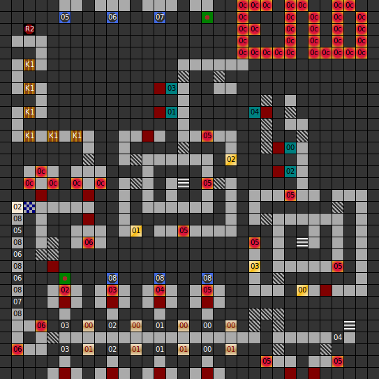

Internal map ID: __9__

### Map

### Key

### Questions

* Question 00: "A" (En); "A" (De) _(Unused)_
* Answer 00: A (En); A (De) _(Unused)_

### Messages

* 00: SWITCH?? (En);
  SCHALTER?? (De)
* 01: SWITCH!! (En);
  SCHALTER!! (De)
* 02: ARE YOU READY.. (En);
  MACH DICH BEREIT. (De)
* 03: WELCOME YOUR FOOLS. I'LL REVENGE FOR MY FATHER. FIRST I'LL KILL YOU,THAN I CONQUER AVALON. HA HA HA HAAAAA. (En);
  WILKOMMEN IHR NARREN. ICH WILL RACHE F&Uuml;R MEINEN VATER.ERST KOMMT IHR DRAN .DANN EROBERE ICH AVALON. HA HA HA HAAAA. (De)

### Chests

* 00: Killmagic, Killmagic
* 01: Killmagic, Killmagic
* 02: Killmagic
* 03: Killmagic

### Notes

* This is the only level in _Dungeons of Avalon II_ which requires Key 1. There
  are six such doors on this level, and six Key 1s in the game in total.
* This level loops North-South, although it's not possible to loop indefinitely.
  Looping is used to allow for the rooms with buttons 5, 6 and 7.

Prev: [&laquo; Map: Tower of Roa (DoA2), level B1](doa2-tower-b1.html)
