Items marked "1" or "2" refer to their items as they appear in _Dungeons of
Avalon_ or _Dungeons of Avalon II_ respectively. Some items appear in only one
game, or change between games.  Items with limited uses only apply when it is
"used", i.e. casting a spell from the item, throwing a weapon or shooting an
arrow.

### Armours

| DoA1 | DoA2 | Item                 |  Buy  | Sell  | Name 
|------|------|----------------------|------:|------:|------------------------------------------
|  |  |  Armour               |   30g |   27g |  Adds +2 armor. Unknown bit 6. 
|  |  |  Ara's Armour         |  100g |   88g |  Adds +3 armor. Unknown bit 6. 
| 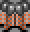 |  |  Knight Armour        |   75g |   66g |  Adds +3 armor. Unknown bit 6. 
|  |  |  Robe&sup1;           |   10g |    9g |  Adds +1 armor. Unknown bit 6. 
|  |  |  Robe&sup2;           |    5g |    5g |  Adds +1 armor. Unknown bit 6. 
|  |  |  Healing Robe&sup1;   |   60g |   53g |  Adds +1 armor. When used, casts Healing II. Can be used 15 times. Unknown bits 4, 0. 
|  |  |  Healing Robe&sup2;   |   40g |   35g |  Adds +1 armor. When used, casts Healing II. Can be used 15 times. Unknown bits 4, 0. 

### Shields

| DoA1 | DoA2 | Item                 |  Buy  | Sell  | Name 
|------|------|----------------------|------:|------:|------------------------------------------
|  |  |  Ara's Shield         | 1500g | 1313g |  Adds +1 attack. Adds +4 armor. When used, casts Frost Breath. Can be used 50 times. Unknown bits 4, 0. 
|  |  |  Wood Shield          |   15g |   14g |  Adds +1 armor. Unknown bit 6. 
| 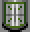 |  |  Metal Shield         |  175g |  154g |  Adds +2 armor. Unknown bit 6. 
|  |  |  Buckler              |  150g |  132g |  Adds +3 armor. Unknown bit 6. 
|  |  |  Fire Shield          | 1000g |  875g |  Adds +1 attack. Adds +4 armor. When used, casts Firefist. Can be used 50 times. Unknown bits 4, 0. 

### Rings

| DoA1 | DoA2 | Item                 |  Buy  | Sell  | Name 
|------|------|----------------------|------:|------:|------------------------------------------
|  |  |  Bee-Ring             |   45g |   40g |  Adds +1 armor. When used, casts Swarm Of Bees. Can be used 10 times. Unknown bits 4, 0. 
|  |  |  Stone-Ring           |  235g |  206g |  Adds +1 attack. When used, casts Medusas Eye. Can be used 5 times. Unknown bits 4, 0. 
|  |  |  Silver-Ring          |   45g |   40g |  Adds +1 attack. Adds +1 armor. When used, casts Silver Speer. Can be used 15 times. Unknown bits 4, 0. 

### Helmets

| DoA1 | DoA2 | Item                 |  Buy  | Sell  | Name 
|------|------|----------------------|------:|------:|------------------------------------------
|  |  |  Battle Helmet        |   50g |   44g |  Adds +3 armor. Unknown bit 6. 
|  |  |  Power Helmet         |   30g |   27g |  Adds +2 armor. Unknown bit 6. 
|  |  |  Helmet               |   20g |   18g |  Adds +1 armor. Unknown bit 6. 
|  |  |  Arc's Helmet         |  100g |   88g |  Adds +2 armor. When used, casts Flame Ball. Can be used 50 times. Unknown bits 4, 0. 
|  |  |  Sefer's Helmet       |  150g |  132g |  Adds +2 armor. When used, casts Frost Breath. Can be used 75 times. Unknown bits 4, 0. 

### One-handed weapons

| DoA1 | DoA2 | Item                 |  Buy  | Sell  | Name 
|------|------|----------------------|------:|------:|------------------------------------------
|  | 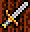 |  Sword                |   15g |   14g |  Deals 12 damage. Adds +3 attack. Unknown bit 0. 
|  | 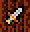 |  Dagger               |    5g |    5g |  Deals 5 damage. Effective at range. Adds +1 attack. Unknown bits 2, 1, 0. 
| 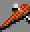 |  |  Club&sup1;           |   12g |   11g |  Deals 10 damage. Adds +1 attack. Unknown bits 3, 1, 0. 
|  | 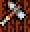 |  Warhammer&sup2;      |   12g |   11g |  Deals 13 damage. Adds +1 attack. Unknown bits 3, 1, 0. 
|  |  |  Battle Axe           |   17g |   15g |  Deals 15 damage. Effective at range. Adds +2 attack. Unknown bits 2, 0. 
|  |  |  War Staff&sup1;      |   16g |   14g |  Deals 15 damage. Adds +2 attack. Unknown bits 3, 1. 
|  | 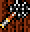 |  Warstaff&sup2;       |   16g |   14g |  Deals 15 damage. Adds +2 attack. Unknown bits 3, 1. 
|  |  |  Mace&sup1;           |   17g |   15g |  Deals 15 damage. Adds +2 attack. Unknown bits 3, 0. 
|  |  |  Mace&sup2;           |   20g |   18g |  Deals 15 damage. Adds +2 attack. Unknown bits 3, 0. 
| 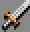 | 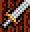 |  Broadsword           |   25g |   22g |  Deals 17 damage. Adds +4 attack. Unknown bit 0. 
|  |  |  Bolas&sup1;          |   75g |   66g |  Deals 18 damage. Effective at range. Adds +2 attack. Can be used 20 times. Unknown bits 3, 2, 0. 
|  |  |  Bolas&sup2;          |   45g |   40g |  Deals 18 damage. Effective at range. Adds +2 attack. Can be used 20 times. Unknown bits 3, 2, 0. 
| 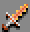 | 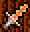 |  Firedagger           |  150g |  132g |  Deals 12 damage. Effective at range. Adds +3 attack. When used, casts Flame Tonge. Can be used 25 times. Unknown bits 2, 1, 0. 
| 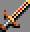 | 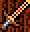 |  Deathbringer         |  200g |  175g |  Deals 45 damage. Adds +4 attack. Adds +1 armor. Unknown bit 0. 
|  |  |  Ruby Dagger&sup1;    |  150g |  132g |  Deals 10 damage. Effective at range. Adds +2 attack. Adds +1 armor. When used, casts Acid Breath. Can be used 25 times. Unknown bits 2, 1, 0. 
|  |  |  Dragonslayer&sup2;   |  150g |  132g |  Deals 40 damage. Adds +2 attack. Adds +1 armor. Unknown bit 0. 
|  | 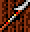 |  Arc's Speer          | 1000g |  875g |  Deals 25 damage. Effective at range. Adds +4 attack. Adds +1 armor. Unknown bits 1, 0. 
| 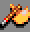 |  |  Arc's Axe            | 1100g |  963g |  Deals 20 damage. Effective at range. Adds +4 attack. Adds +1 armor. Unknown bits 2, 0. 
|  |  |  Arc's Sword          | 1200g | 1050g |  Deals 80 damage. Adds +4 attack. Adds +1 armor. Unknown bit 0. 
|  |  |  Arc's Boolas         | 1200g | 1050g |  Deals 30 damage. Effective at range. Adds +3 attack. Adds +1 armor. Can be used 40 times. Unknown bits 3, 2, 0. 
|  | 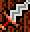 |  Killersword          |  200g |  175g |  Deals 45 damage. Adds +4 attack. Adds +1 armor. Unknown bit 0. 

### Arrows

| DoA1 | DoA2 | Item                 |  Buy  | Sell  | Name 
|------|------|----------------------|------:|------:|------------------------------------------
| 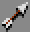 |  |  Arrows               |    5g |    5g |  Deals 5 damage. Effective at range. Adds +4 attack. Can be used 10 times. Unknown bits 3, 2, 1, 0. 
|  |  |  Elf Arrows           |    7g |    7g |  Deals 7 damage. Effective at range. Adds +4 attack. Can be used 15 times. Unknown bits 3, 2, 1, 0. 
| 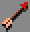 | 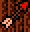 |  Kel's Arrows         |  200g |  175g |  Deals 5 damage. Effective at range. Adds +4 attack. Unknown bits 3, 2, 1, 0. 

### Two-handed weapons

| DoA1 | DoA2 | Item                 |  Buy  | Sell  | Name 
|------|------|----------------------|------:|------:|------------------------------------------
|  |  |  Staff&sup1;          |    8g |    7g |  Deals 8 damage. Adds +3 attack. Unknown bits 3, 2. 
| 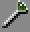 |  |  Magic-Staff&sup1;    |  100g |   88g |  Deals 10 damage. Adds +1 attack. When used, casts Falconfang. Can be used 50 times. Unknown bits 3, 2. 
| 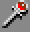 |  |  Wizard-Staff&sup1;   |  100g |   88g |  Deals 10 damage. Adds +1 attack. When used, casts Shock. Can be used 50 times. Unknown bits 3, 2. 
| 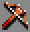 | 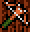 |  Crossbow             |   35g |   31g |  Deals 7 damage. Effective at range. Adds +3 attack. Unknown bit 1. 
|  | 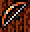 |  Longbow              |   25g |   22g |  Deals 5 damage. Effective at range. Adds +2 attack. Unknown bit 1. 
| 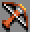 |  |  Kel's Crossbow&sup1; |   40g |   35g |  Deals 10 damage. Effective at range. Adds +4 attack. Unknown bit 1. 
|  |  |  Kel's Crossbow&sup2; |   50g |   44g |  Deals 10 damage. Effective at range. Adds +4 attack. Unknown bit 1. 

### Unknowns

| DoA1 | DoA2 | Item                 |  Buy  | Sell  | Name 
|------|------|----------------------|------:|------:|------------------------------------------
|  | 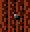 |  Unknown              |    0g |    0g |  Deals 3 damage. 

### Other items

| DoA1 | DoA2 | Item                 |  Buy  | Sell  | Name 
|------|------|----------------------|------:|------:|------------------------------------------
|  | 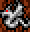 |  Dragonfigure&sup2;   |  500g |  438g |  Unknown bit 6. 
|  |  |  Dragonstone&sup2;    |  100g |   88g |  Unknown bit 6. 
|  |  |  Diamond&sup2;        |  500g |  438g |  Unknown bit 6. 
|  |  |  New Live             |  100g |   88g |  Deals 11 damage. When used, casts New Live. Can only be used once. Unknown bits 4, 0. 
|  |  |  Spellbook&sup1;      |    1g |    1g |  Unknown bit 6. 
|  |  |  Spellbook&sup2;      |    5g |    5g |  Unknown bit 6. 
| 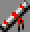 |  |  Deadly Flash         |   45g |   40g |  When used, casts Deadly Flash. Can only be used once. Unknown bits 4, 0. 
|  |  |  Anti-Aura            | 5000g | 4375g |  When used, casts Anti-Aura. Can only be used once. Unknown bits 4, 0. 
|  |  |  The Rune&sup1;       | 5000g | 4375g |  Unknown bits 4, 1. 
|  |  |  ----&sup2;           |    0g |    0g |  Unknown bit 6. 
|  |  |  Wasp Sting           |   10g |    9g |  When used, casts Wasp Sting. Can only be used once. Unknown bits 4, 0. 
|  |  |  Chest&sup1;          |  500g |  438g |  Can only be used once. Unknown bit 6. 
|  |  |  Chest&sup2;          |  500g |  438g |  Unknown bit 6. 
|  |  |  Healing Potion&sup1; |   14g |   13g |  Can only be used once. Unknown bits 6, 2. 
|  |  |  Healing Potion&sup2; |   10g |    9g |  Can only be used once. Unknown bits 6, 2. 
|  |  |  Healing Potion&sup1; |   11g |   10g |  When used, casts Healing. Can only be used once. Unknown bits 6, 2. 
|  |  |  Healing Potion&sup2; |   10g |    9g |  When used, casts Healing. Can only be used once. Unknown bits 6, 2. 
|  | 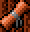 |  Scroll 1             |    2g |    2g |  Unknown bits 6, 1. 
|  |  |  Scroll 2             |    2g |    2g |  When used, casts Healing. Unknown bits 6, 1. 
|  |  |  Scroll 3             |    2g |    2g |  When used, casts Healing II. Unknown bits 6, 1. 
|  |  |  Scroll 4&sup1;       |    2g |    2g |  When used, casts Healing III. Unknown bits 6, 1. 
|  |  |  Permission&sup2;     |    2g |    2g |  When used, casts Healing III. Unknown bits 6, 1. 
|  |  |  Antipoisen           |    8g |    7g |  When used, casts Repoisen. Can only be used once. Unknown bits 4, 0. 
|  |  |  Restone              |    9g |    8g |  When used, casts Restone. Can only be used once. Unknown bits 4, 0. 
|  |  |  Restoration          |   19g |   17g |  When used, casts Restoration. Can only be used once. Unknown bits 4, 0. 
|  |  |  Ice Breath           |    7g |    7g |  When used, casts Frost Breath. Can only be used once. Unknown bits 4, 0. 
|  |  |  Eaglefang            |   20g |   18g |  When used, casts Eaglefang. Can only be used once. Unknown bits 4, 0. 
|  |  |  Healing II           |    6g |    6g |  When used, casts Healing II. Can only be used once. Unknown bits 4, 0. 
|  |  |  Magic Eye&sup1;      |    4g |    4g |  When used, casts Magic Eye. Can only be used once. Unknown bits 4, 0. 
|  |  |  Magic Eye&sup2;      |    4g |    4g |  When used, casts Magic Eye. Can only be used once. Unknown bits 4, 0. 
|  |  |  Magic Armour&sup1;   |    5g |    5g |  When used, casts Magic Armour. Can only be used once. Unknown bits 4, 0. 
|  |  |  Magic Armour&sup2;   |    5g |    5g |  When used, casts Magic Armour. Can only be used once. Unknown bits 4, 0. 
|  |  |  Troll Bones&sup1;    |    5g |    5g |  Can only be used once. Unknown bits 6, 1, 0. 
|  |  |  Flint&sup2;          |    5g |    5g |  Can only be used once. Unknown bits 6, 1, 0. 
|  |  |  Elf Bones&sup1;      |    5g |    5g |  When used, casts Healing. Can only be used once. Unknown bits 6, 1, 0. 
|  |  |  Rahven&sup2;         |    5g |    5g |  When used, casts Healing. Can only be used once. Unknown bits 6, 1, 0. 
|  |  |  Gnom Bones&sup1;     |    5g |    5g |  When used, casts Healing II. Can only be used once. Unknown bits 6, 1, 0. 
|  |  |  ----&sup2;           |    5g |    5g |  Unknown bit 6. 
|  |  |  Dwarf Bones&sup1;    |    5g |    5g |  When used, casts Healing III. Can only be used once. Unknown bits 6, 1, 0. 
|  |  |  ----&sup2;           |    5g |    5g |  Unknown bit 6. 
|  |  |  Stemberfang          |   25g |   22g |  When used, casts Stemberfang. Can only be used once. Unknown bits 4, 0. 
|  |  |  Key 1                |    1g |    1g |  Can only be used once. Unknown bits 6, 0. 
|  |  |  Key 2                |    1g |    1g |  Can only be used once. Unknown bits 6, 0. 
|  |  |  Key 3                |    1g |    1g |  Can only be used once. Unknown bits 6, 0. 
|  |  |  Key 4                |    1g |    1g |  Can only be used once. Unknown bits 6, 0. 
|  |  |  Eagles View&sup1;    |   35g |   31g |  When used, casts Eagles View. Can only be used once. Unknown bits 4, 0. 
|  |  |  Eagles View&sup2;    |   35g |   31g |  When used, casts Eagles View. Can only be used once. Unknown bits 4, 0. 
|  |  |  Birds View&sup1;     |   25g |   22g |  When used, casts Birds View. Can only be used once. Unknown bits 4, 0. 
|  |  |  Birds View&sup2;     |   25g |   22g |  When used, casts Birds View. Can only be used once. Unknown bits 4, 0. 
|  |  |  -----&sup1;          |    1g |    1g |  Can only be used once. Unknown bits 6, 0. 
|  |  |  Levitation&sup2;     |    1g |    1g |  When used, casts Levitation. Can only be used once. Unknown bits 4, 0. 
|  |  |  -----&sup1;          |    1g |    1g |  Can only be used once. Unknown bits 6, 0. 
|  |  |  Killmagic&sup2;      |    1g |    1g |  When used, casts Killmagic. Can only be used once. Unknown bits 4, 0. 
|  |  |  -----&sup1;          |    1g |    1g |  Unknown bits 6, 0. 
|  |  |  Disarm Trap&sup2;    |    1g |    1g |  When used, casts Disarm Trap. Can only be used once. Unknown bits 4, 0. 
|  |  |  Left                 |    0g |    0g |  Unknown bit 6. 
|  |  |  Right                |    0g |    0g |  Unknown bit 6. 

### Items by bonus

The following items give the numbered bonus to attack:

1. Dagger, Warhammer, Stone-Ring, Silver-Ring, Ara's Shield, Fire Shield
2. Battle Axe, Warstaff, Mace, Longbow, Bolas, Dragonslayer
3. Sword, New Live, Crossbow, Firedagger, Arc's Boolas
4. Arc's Axe, Arc's Speer, Arc's Sword, Broadsword, Killersword, Deathbringer,
   Arrows, Elf Arrows, Kel's Arrows, Kel's Crossbow

The following items give the numbered bonus to defense:

1. Arc's Axe, Arc's Boolas, Arc's Speer, Arc's Sword, Bee-Ring,
   Deathbringer, Dragonslayer, Healing Robe, Helmet, Killersword,
   Robe, Silver-Ring, Wood Shield
2. Armour, Metal Shield, Sefer's/Arc's/Power Helmet
3. Ara's Armour, Knight Armour, Battle Helmet, Buckler
4. Ara's Shield, Fire Shield

### Items usable by each class

Items marked "(1)" or "(2)" are exclusive to _Dungeons of Avalon_ 1 or 2
respectively.

| ID | Item             |  Ftr  |  Thf  |  Kgt  |  Hnt  |  Mnk  |  Mag  |  Hlr  |  Wiz  |
|----|------------------|:-----:|:-----:|:-----:|:-----:|:-----:|:-----:|:-----:|:-----:|
| 00 | UNKNOWN          |__Yes__|__Yes__|__Yes__|__Yes__|__Yes__|__Yes__|__Yes__|__Yes__|
| 01 | ARA'S SHIELD     |__Yes__| _No_  |__Yes__|__Yes__| _No_  | _No_  | _No_  | _No_  |
| 02 | WOOD SHIELD      |__Yes__|__Yes__|__Yes__|__Yes__|__Yes__|__Yes__|__Yes__|__Yes__|
| 03 | METAL SHIELD     |__Yes__| _No_  |__Yes__|__Yes__| _No_  | _No_  | _No_  | _No_  |
| 04 | BUCKLER          |__Yes__|__Yes__|__Yes__|__Yes__| _No_  | _No_  | _No_  | _No_  |
| 05 | FIRE SHIELD      |__Yes__| _No_  |__Yes__|__Yes__| _No_  | _No_  | _No_  | _No_  |
| 06 | SWORD            |__Yes__|__Yes__|__Yes__|__Yes__|__Yes__| _No_  | _No_  | _No_  |
| 07 | DAGGER           |__Yes__|__Yes__|__Yes__|__Yes__|__Yes__|__Yes__|__Yes__|__Yes__|
| 08 | CLUB         (1) |__Yes__|__Yes__|__Yes__|__Yes__| _No_  | _No_  | _No_  | _No_  |
| 08 | WARHAMMER    (2) |__Yes__|__Yes__|__Yes__|__Yes__| _No_  | _No_  | _No_  | _No_  |
| 09 | BATTLE AXE       |__Yes__| _No_  |__Yes__|__Yes__| _No_  | _No_  | _No_  | _No_  |
| 0A | WARSTAFF         |__Yes__| _No_  |__Yes__|__Yes__| _No_  | _No_  | _No_  | _No_  |
| 0B | STAFF        (1) |__Yes__|__Yes__|__Yes__|__Yes__|__Yes__|__Yes__|__Yes__|__Yes__|
| 0B | DRAGONFIGURE (2) |__Yes__|__Yes__|__Yes__|__Yes__|__Yes__|__Yes__|__Yes__|__Yes__|
| 0C | MAGIC-STAFF  (1) | _No_  | _No_  | _No_  | _No_  |__Yes__|__Yes__|__Yes__|__Yes__|
| 0C | DRAGONSTONE  (2) |__Yes__|__Yes__|__Yes__|__Yes__|__Yes__|__Yes__|__Yes__|__Yes__|
| 0D | WIZARD-STAFF (1) | _No_  | _No_  | _No_  | _No_  |__Yes__|__Yes__|__Yes__|__Yes__|
| 0D | DIAMOND      (2) |__Yes__|__Yes__|__Yes__|__Yes__|__Yes__|__Yes__|__Yes__|__Yes__|
| 0E | MACE             |__Yes__| _No_  |__Yes__|__Yes__| _No_  | _No_  | _No_  | _No_  |
| 0F | BROADSWORD       |__Yes__| _No_  |__Yes__| _No_  | _No_  | _No_  | _No_  | _No_  |
| 10 | NEW LIVE         |__Yes__|__Yes__|__Yes__|__Yes__|__Yes__|__Yes__|__Yes__|__Yes__|
| 11 | SPELLBOOK        | _No_  | _No_  | _No_  | _No_  |__Yes__|__Yes__|__Yes__|__Yes__|
| 12 | DEADLY FLASH     |__Yes__|__Yes__|__Yes__|__Yes__|__Yes__|__Yes__|__Yes__|__Yes__|
| 13 | ANTI-AURA        |__Yes__|__Yes__|__Yes__|__Yes__|__Yes__|__Yes__|__Yes__|__Yes__|
| 14 | CROSSBOW         |__Yes__|__Yes__|__Yes__|__Yes__| _No_  | _No_  | _No_  | _No_  |
| 15 | LONGBOW          |__Yes__|__Yes__|__Yes__|__Yes__|__Yes__|__Yes__|__Yes__|__Yes__|
| 16 | KEL'S CROSSBOW   |__Yes__| _No_  |__Yes__|__Yes__| _No_  | _No_  |__Yes__| _No_  |
| 17 | ARROWS           |__Yes__|__Yes__|__Yes__|__Yes__|__Yes__|__Yes__|__Yes__|__Yes__|
| 18 | ELF ARROWS       |__Yes__|__Yes__|__Yes__|__Yes__|__Yes__|__Yes__|__Yes__|__Yes__|
| 19 | KEL'S ARROWS     |__Yes__| _No_  |__Yes__|__Yes__| _No_  | _No_  |__Yes__| _No_  |
| 1A | BEE-RING         |__Yes__|__Yes__|__Yes__|__Yes__|__Yes__|__Yes__|__Yes__|__Yes__|
| 1B | STONE-RING       |__Yes__|__Yes__|__Yes__|__Yes__|__Yes__|__Yes__|__Yes__|__Yes__|
| 1C | SILVER-RING      |__Yes__|__Yes__|__Yes__|__Yes__|__Yes__|__Yes__|__Yes__|__Yes__|
| 1D | THE RUNE     (1) |__Yes__|__Yes__|__Yes__|__Yes__|__Yes__|__Yes__|__Yes__|__Yes__|
| 1D | ----         (2) |__Yes__|__Yes__|__Yes__|__Yes__|__Yes__|__Yes__|__Yes__|__Yes__|
| 1E | WASP STING       |__Yes__|__Yes__|__Yes__|__Yes__|__Yes__|__Yes__|__Yes__|__Yes__|
| 1F | BATTLE HELMET    |__Yes__| _No_  |__Yes__|__Yes__| _No_  | _No_  | _No_  | _No_  |
| 20 | POWER HELMET     |__Yes__| _No_  |__Yes__|__Yes__| _No_  | _No_  | _No_  | _No_  |
| 21 | HELMET           |__Yes__|__Yes__|__Yes__|__Yes__|__Yes__|__Yes__|__Yes__|__Yes__|
| 22 | ARC'S HELMET     |__Yes__| _No_  |__Yes__|__Yes__| _No_  | _No_  | _No_  | _No_  |
| 23 | SEFER'S HELMET   |__Yes__|__Yes__|__Yes__|__Yes__| _No_  | _No_  | _No_  | _No_  |
| 24 | ARMOUR           |__Yes__|__Yes__|__Yes__|__Yes__| _No_  | _No_  | _No_  | _No_  |
| 25 | ARA'S ARMOUR     |__Yes__| _No_  |__Yes__|__Yes__| _No_  | _No_  | _No_  | _No_  |
| 26 | KNIGHT ARMOUR    |__Yes__| _No_  |__Yes__| _No_  | _No_  | _No_  | _No_  | _No_  |
| 27 | ROBE             |__Yes__|__Yes__|__Yes__|__Yes__|__Yes__|__Yes__|__Yes__|__Yes__|
| 28 | HEALING ROBE     | _No_  | _No_  | _No_  | _No_  |__Yes__|__Yes__|__Yes__|__Yes__|
| 29 | BOLAS            |__Yes__|__Yes__|__Yes__|__Yes__|__Yes__|__Yes__|__Yes__|__Yes__|
| 2A | FIREDAGGER       | _No_  | _No_  | _No_  | _No_  |__Yes__|__Yes__|__Yes__|__Yes__|
| 2B | DEATHBRINGER     |__Yes__| _No_  |__Yes__|__Yes__| _No_  | _No_  | _No_  | _No_  |
| 2C | CHEST            |__Yes__|__Yes__|__Yes__|__Yes__|__Yes__|__Yes__|__Yes__|__Yes__|
| 2D | RUBY DAGGER  (1) | _No_  | _No_  | _No_  | _No_  | _No_  |__Yes__| _No_  | _No_  |
| 2D | DRAGONSLAYER (2) |__Yes__|__Yes__|__Yes__|__Yes__| _No_  | _No_  | _No_  | _No_  |
| 2E | HEALING POTION   |__Yes__|__Yes__|__Yes__|__Yes__|__Yes__|__Yes__|__Yes__|__Yes__|
| 2F | HEALING POTION   |__Yes__|__Yes__|__Yes__|__Yes__|__Yes__|__Yes__|__Yes__|__Yes__|
| 30 | SCROLL 1         |__Yes__|__Yes__|__Yes__|__Yes__|__Yes__|__Yes__|__Yes__|__Yes__|
| 31 | SCROLL 2         |__Yes__|__Yes__|__Yes__|__Yes__|__Yes__|__Yes__|__Yes__|__Yes__|
| 32 | SCROLL 3         |__Yes__|__Yes__|__Yes__|__Yes__|__Yes__|__Yes__|__Yes__|__Yes__|
| 33 | SCROLL 4     (1) |__Yes__|__Yes__|__Yes__|__Yes__|__Yes__|__Yes__|__Yes__|__Yes__|
| 33 | PERMISSION   (2) |__Yes__|__Yes__|__Yes__|__Yes__|__Yes__|__Yes__|__Yes__|__Yes__|
| 34 | ANTIPOISEN       |__Yes__|__Yes__|__Yes__|__Yes__|__Yes__|__Yes__|__Yes__|__Yes__|
| 35 | RESTONE          |__Yes__|__Yes__|__Yes__|__Yes__|__Yes__|__Yes__|__Yes__|__Yes__|
| 36 | RESTORATION      |__Yes__|__Yes__|__Yes__|__Yes__|__Yes__|__Yes__|__Yes__|__Yes__|
| 37 | ICE BREATH       |__Yes__|__Yes__|__Yes__|__Yes__|__Yes__|__Yes__|__Yes__|__Yes__|
| 38 | EAGLEFANG        |__Yes__|__Yes__|__Yes__|__Yes__|__Yes__|__Yes__|__Yes__|__Yes__|
| 39 | HEALING II       |__Yes__|__Yes__|__Yes__|__Yes__|__Yes__|__Yes__|__Yes__|__Yes__|
| 3A | MAGIC EYE        |__Yes__|__Yes__|__Yes__|__Yes__|__Yes__|__Yes__|__Yes__|__Yes__|
| 3B | MAGIC ARMOUR     |__Yes__|__Yes__|__Yes__|__Yes__|__Yes__|__Yes__|__Yes__|__Yes__|
| 3C | TROLL BONES  (1) |__Yes__|__Yes__|__Yes__|__Yes__|__Yes__|__Yes__|__Yes__|__Yes__|
| 3C | FLINT        (2) |__Yes__|__Yes__|__Yes__|__Yes__|__Yes__|__Yes__|__Yes__|__Yes__|
| 3D | ELF BONES    (1) |__Yes__|__Yes__|__Yes__|__Yes__|__Yes__|__Yes__|__Yes__|__Yes__|
| 3D | RAHVEN       (2) |__Yes__|__Yes__|__Yes__|__Yes__|__Yes__|__Yes__|__Yes__|__Yes__|
| 3E | GNOM BONES   (1) |__Yes__|__Yes__|__Yes__|__Yes__|__Yes__|__Yes__|__Yes__|__Yes__|
| 3E | ----         (2) |__Yes__|__Yes__|__Yes__|__Yes__|__Yes__|__Yes__|__Yes__|__Yes__|
| 3F | DWARF BONES  (1) |__Yes__|__Yes__|__Yes__|__Yes__|__Yes__|__Yes__|__Yes__|__Yes__|
| 3F | ----         (2) |__Yes__|__Yes__|__Yes__|__Yes__|__Yes__|__Yes__|__Yes__|__Yes__|
| 40 | STEMBERFANG      |__Yes__|__Yes__|__Yes__|__Yes__|__Yes__|__Yes__|__Yes__|__Yes__|
| 41 | ARC'S SPEER      |__Yes__| _No_  |__Yes__|__Yes__| _No_  | _No_  | _No_  | _No_  |
| 42 | ARC'S AXE        |__Yes__| _No_  |__Yes__|__Yes__|__Yes__|__Yes__|__Yes__|__Yes__|
| 43 | ARC'S SWORD      |__Yes__| _No_  |__Yes__|__Yes__| _No_  | _No_  | _No_  | _No_  |
| 44 | ARC'S BOOLAS     | _No_  | _No_  | _No_  | _No_  |__Yes__|__Yes__|__Yes__|__Yes__|
| 45 | KILLERSWORD      |__Yes__| _No_  |__Yes__|__Yes__| _No_  | _No_  | _No_  | _No_  |
| 46 | KEY 1            |__Yes__|__Yes__|__Yes__|__Yes__|__Yes__|__Yes__|__Yes__|__Yes__|
| 47 | KEY 2            |__Yes__|__Yes__|__Yes__|__Yes__|__Yes__|__Yes__|__Yes__|__Yes__|
| 48 | KEY 3            |__Yes__|__Yes__|__Yes__|__Yes__|__Yes__|__Yes__|__Yes__|__Yes__|
| 49 | KEY 4            |__Yes__|__Yes__|__Yes__|__Yes__|__Yes__|__Yes__|__Yes__|__Yes__|
| 4A | EAGLES VIEW      |__Yes__|__Yes__|__Yes__|__Yes__|__Yes__|__Yes__|__Yes__|__Yes__|
| 4B | BIRDS VIEW       |__Yes__|__Yes__|__Yes__|__Yes__|__Yes__|__Yes__|__Yes__|__Yes__|
| 4C | -----        (1) |__Yes__|__Yes__|__Yes__|__Yes__|__Yes__|__Yes__|__Yes__|__Yes__|
| 4C | LEVITATION   (2) |__Yes__|__Yes__|__Yes__|__Yes__|__Yes__|__Yes__|__Yes__|__Yes__|
| 4D | -----        (1) |__Yes__|__Yes__|__Yes__|__Yes__|__Yes__|__Yes__|__Yes__|__Yes__|
| 4D | KILLMAGIC    (2) |__Yes__|__Yes__|__Yes__|__Yes__|__Yes__|__Yes__|__Yes__|__Yes__|
| 4E | -----        (1) |__Yes__|__Yes__|__Yes__|__Yes__|__Yes__|__Yes__|__Yes__|__Yes__|
| 4E | DISARM TRAP  (2) |__Yes__|__Yes__|__Yes__|__Yes__|__Yes__|__Yes__|__Yes__|__Yes__|
| 4F | LEFT             |__Yes__|__Yes__|__Yes__|__Yes__|__Yes__|__Yes__|__Yes__|__Yes__|
| 50 | RIGHT            |__Yes__|__Yes__|__Yes__|__Yes__|__Yes__|__Yes__|__Yes__|__Yes__|

### Notes on items usable

- Ruby Dagger can be wielded as a weapon, but _only_ by Magician.
  It's easy to miss this, as the default party in _Dungeons of Avalon_ has no
  Magician.
- Magic-Staff, Wizard-Staff,
  Spellbook, Healing Robe, Arc's Boolas and Firedagger can be used by all
  spellcasters (Monk, Magician, Healer, Wizard), and only spellcasters.
- Other than the seven items just mentioned, the Fighter and Knight can use all
  items.
- The Hunter can use every item that the Fighter and Knight can, except for
  Knight Armour and Broadsword.
- Every class can use Arc's Axe, except Thief. This may have something to do
  with its original name in German, "Arc's Wurfaxt", or Arc's Throwing Axe.
- Arc's Boolas can only be used by spellcasters, but Arc's Sword and Arc's Speer
  can only be used by non-spellcasters.
- The Healer can use Kel's Arrows and Kel's Crossbow, despite the fact that they
  can't use the normal Crossbow. Conversely, the Thief can use Crossbow, but not
  Kel's Crossbow.
- All four non-spellcaster classes, plus the Monk, can use the sword.
- All four non-spellcasters, including the Thief, can use Buckler, Warhammer,
  Crossbow, Armour, Sefer's Helmet, and Dragonslayer. However, many other items
  exclusive to the Fighter, Knight and Hunter are unavailable to the Thief.
- "Left" and "Right" appear to be dummy items to represent an empty-handed
  character's hands.
