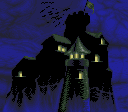
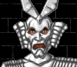
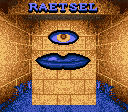
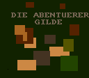

The following are graphics extracted from the file `DAT/PICS`. They represent
all graphics which fill the main box; i.e. town scenes and monster graphics.
Monsters marked with a &dagger; symbol are unused; i.e. they appear in the game
files but cannot normally be encountered in the game.

### Dungeons of Avalon I

{:width="256" height="224"} 
"PIC #00" (unused)
{:.left}

{:width="256" height="224"} 
Shop
{:.left}

{:width="256" height="224"} 
Temple
{:.left}

{:width="256" height="224"} 
Kham
{:.left}

{:width="256" height="224"} 
The City Ghale
{:.left}

{:width="256" height="224"} 
The City H'Khan
{:.left}

{:width="256" height="224"} 
Tavern
{:.left}

{:width="256" height="224"} 
Rhateph's Castle
{:.left}

{:width="256" height="224"} 
The Wise Three
{:.left}

{:width="256" height="224"} 
"PIC #09" (unused)
{:.left}

{:width="256" height="224"} 
Thorndragon&dagger;
{:.left}

{:width="256" height="224"} 
Worm, Hellworm
{:.left}

{:width="256" height="224"} 
Troll, Master Troll
{:.left}

{:width="256" height="224"} 
Silly Guard, Guard
{:.left}

{:width="256" height="224"} 
Elistaire, Green Dragon,&dagger; Dragon&dagger;
{:.left}

{:width="256" height="224"} 
Unused graphic&dagger;
{:.left}

{:width="256" height="224"} 
Spider, Great Spider&dagger;
{:.left}

{:width="256" height="224"} 
Silly Walker
{:.left}

{:width="256" height="224"} 
Vampire&dagger;
{:.left}

{:width="256" height="224"} 
Gnom, Master Gnom
{:.left}

{:width="256" height="224"} 
Phantom&dagger;
{:.left}

{:width="256" height="224"} 
Magician, Master Mage&dagger;
{:.left}

{:width="256" height="224"} 
Silver Ninja, Ninja&dagger;
{:.left}

{:width="256" height="224"} 
Woodoo Man&dagger;
{:.left}

{:width="256" height="224"} 
Vulture
{:.left}

{:width="256" height="224"} 
Devil&dagger;
{:.left}

{:width="256" height="224"} 
Alien&dagger;
{:.left}

{:width="256" height="224"} 
Unused graphic&dagger;
{:.left}

{:width="256" height="224"} 
Dark Lord
{:.left}

{:width="256" height="224"} 
Unused graphic&dagger;
{:.left}

{:width="256" height="224"} 
Blue Dragon&dagger;
{:.left}

{:width="256" height="224"} 
Fire Troll
{:.left}

{:width="256" height="224"} 
Fire Dragon
{:.left}

{:width="256" height="224"} 
Gnom King, Hellgnom
{:.left}

{:width="256" height="224"} 
Pure Worm
{:.left}

{:width="256" height="224"} 
Unused graphic&dagger;
{:.left}

{:width="256" height="224"} 
Unused graphic&dagger;
{:.left}

{:width="256" height="224"} 
Unused graphic&dagger;
{:.left}

{:width="256" height="224"} 
Gnom Fighter
{:.left}

 
### Dungeons of Avalon II

{:width="256" height="224"} 
Unused
{:.left}
{:width="256" height="224"} 
Shop
{:.left}
{:width="256" height="224"} 
Temple
{:.left}
{:width="256" height="224"} 
Quiz giver
{:.left}
{:width="256" height="224"} 
Unused
{:.left}
{:width="256" height="224"} 
The City Isla
{:.left}
{:width="256" height="224"} 
Tavern
{:.left}
{:width="256" height="224"} 
Tower of Roa
{:.left}
{:width="256" height="224"} 
The Wise Three
{:.left}
{:width="256" height="224"} 
Unused
{:.left}
{:width="256" height="224"} 
Big Frog
{:.left}
{:width="256" height="224"} 
Big Turtle
{:.left}
{:width="256" height="224"} 
Pest Baby
{:.left}
{:width="256" height="224"} 
Slime Twin, Thiefs Rabun
{:.left}
{:width="256" height="224"} 
Eagle&dagger;
{:.left}
{:width="256" height="224"} 
Werewolf
{:.left}
{:width="256" height="224"} 
Invisible
{:.left}
{:width="256" height="224"} 
Voodoo Man
{:.left}
{:width="256" height="224"} 
Alien
{:.left}
{:width="256" height="224"} 
Zombi
{:.left}
{:width="256" height="224"} 
Big Spider
{:.left}
{:width="256" height="224"} 
Dragon, Elinor
{:.left}
{:width="256" height="224"} 
Devil, Giant Argha
{:.left}
{:width="256" height="224"} 
Fire Troll
{:.left}
{:width="256" height="224"} 
Arc Dragon
{:.left}
{:width="256" height="224"} 
Skelleton
{:.left}
{:width="256" height="224"} 
Guardian, Prison guard
{:.left}
{:width="256" height="224"} 
Magician
{:.left}
{:width="256" height="224"} 
Lord Roa, Fake Lord Roa
{:.left}

 

### Dungeons of Avalon (May 1991 alpha)

Mostly unused early development art. There are entries from #00 to #29 but aside from the ones shown here, the others are blank.

{:width="256" height="224"}  01 Shop
{:.left}

{:width="256" height="224"}  02 Temple
{:.left}

{:width="256" height="224"}  03 Riddle
{:.left}

{:width="256" height="224"}  04 City
{:.left}

{:width="256" height="224"}  05 Inn / Adventurer's Guild
{:.left}

{:width="256" height="224"}  06 Tavern
{:.left}

{:width="256" height="224"}  07 Castle
{:.left}

{:width="256" height="224"}  08 The Three Wises
{:.left}

{:width="256" height="224"}  10 Thorndragon
{:.left}

{:width="256" height="224"}  11 Hell-Worm
{:.left}

{:width="256" height="224"}  12 Troll
{:.left}

 
### Notes

The game credits Klaus Erhardt with "monster grafix" and Frank Matzke for
"monster sketches". Matzke went on to have
[numerous credits](https://www.mobygames.com/person/56269/frank-matzke/credits/sort:date/),
becoming managing director of Bethesda around the time Skyrim was released.

A large number of unused monster graphics appear in the `PICS` file for the
first _Dungeons of Avalon_, mostly because of monsters which do not appear
anywhere in the dungeon. All of the unused art appeared in _Dungeons of Avalon
II_ in some form.

The Thorndragon and Blue Dragon became DoA2's Dragon and the NPC Elinor. Phantom
became Lord Roa. Woodoo Man became Voodoo Man. Devil DoA2's Devil and the NPC
Giant Argha. Alien became Alien. Unused graphics became DoA2's Big Turtle,
Invisible, and Zombi.

DoA2 featured only two pieces of completely original monster art: Big Frog, Pest
Baby, Slime Twin, Eagle, and Werewolf. Of those, Eagle never appears in the
game. The other art is re-used, sometimes with a different palette or graphic
changes.

### Technical notes

Each `PICS` file consists of a set of images concatenated together. Each image
is compressed with PowerPacker, but the first four bytes have been changed from
`PP20` to `XX50` in a form of obfuscation. Interestingly, this specific
obfuscation is mentioned in the documentation for the Track2File decruncher
tool, dated 29 December 1996. This means that even back then, someone was trying
to analyze the _Dungeons of Avalon_ games.

Each decompressed image is 7,200 bytes in size. It begins with a 128 x 112 pixel
16-colour image, stored in 4 bitplanes. This accounts for the first 7,168 bytes
of the file. The next 32 bytes store the image's palette as 16 two-byte values.
Each half-word stores one hexadecimal digit, where the first digit is 0 and the
remaining three are R, G, B.

In DoA1 only, the PICS file has a few zeroes at the end for padding, which need
to be trimmed to unpack with `xfddecrunch`.

In the alpha build, the compressed content uses standard `PP20` headers.
