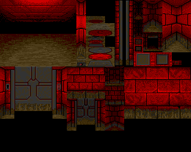
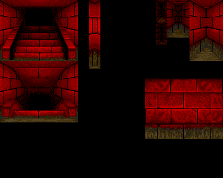
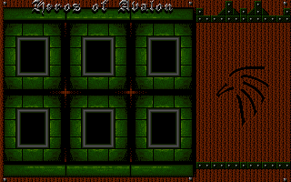
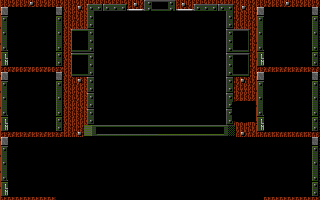
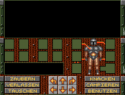
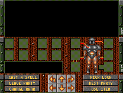
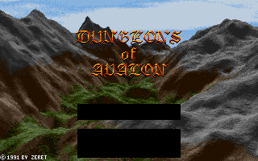
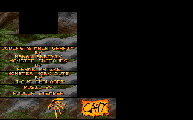

See also [Sprite rip](../data/sprite-rip.md) for an internal spritesheet in the
main game executable, and
[Monster sprites](../data/monster-sprites.md) for the town and monster graphics
from the `PICS` file.

### Dungeons of Avalon

#### DGFX

{:width=640 height=512}

{:width=640 height=512}

#### ENDGFX

{:width=640 height=400}

#### MENU

{:width=640 height=400}

#### PART_D

{:width=416 height=314}

#### PART_E

{:width=416 height=314}

#### TITEL

{:width=640 height=400}

{:width=640 height=400}

#### DATA/PICS

See [Monster and town graphics](../data/monster-sprites.html).

### Dungeons of Avalon II

#### DGFX_1

{:width=640 height=480}

#### DGFX_2

{:width=640 height=480}

#### END1

{:width=640 height=480}

#### END2

{:width=640 height=480}

#### GRUND

{:width=640 height=480}

#### MENU

{:width=640 height=480}

#### PART_D

{:width=416 height=314}

#### PART_E

{:width=416 height=314}

#### SEL_D

{:width=640 height=480}

#### SEL_E

{:width=640 height=480}

#### TITEL_1

{:width=640 height=480}

#### TITEL_2

{:width=640 height=480}

#### DATA/PICS

See [Monster and town graphics](../data/monster-sprites.html).

### Dungeons of Avalon (May 1991 alpha)

These files appear in the
[early alpha version](../secrets/early-alpha-version.html).
They're all compressed with Powerpacker, as suggested by the filenames.

#### cron.pp

{:width=640 height=400}

A-CRON logo, before the collaboration with CYBERSTYLE became known as Zeret.

#### dun1A.pp

{:width=640 height=512}

Dungeon graphics by Rudi Stember.

#### dun1B.pp

{:width=640 height=512}

Dungeon graphics by Rudi Stember.

#### menu.pp

{:width=640 height=400}

Main game UI.

#### titel.pp

{:width=640 height=400}

{:width=640 height=400}

Title screen.

#### DATA/pics

See [Monster and town graphics](../data/monster-sprites.html).
