Monster stats are stored in a table with 10 bytes per monster.

### Data format

00-01
: HP, as a two-byte word. Also used in XP calculation.

02
: Combat verb.
- 00: Hits
- 01: Bites
- 02: Stabs
- 03: Scratchs
- 04: Picks
- 05: Cast a spell: (only used when monsters cast a spell)
- 06: Slayes (should be "slashes")

03
: Base damage. Actual damage is randomly 0-3 points higher. Also used in XP
calculation.

04
: Image ID (see [monster and town graphics ](../data/monster-sprites.html)).

05
: Attack. Attack stat for melee. Attacks hit if this exceeds the target's WC
stat.

06
: Magic Attack. Attack stat for spells. Spells hit of this exceeds the target's
WC stat.

07
: Spell. ID number of a spell this monster can cast.

08
: Status afflicted by attacks. Bitfield: `$80` poisen, `$40` stone, `$10` blind.

09
: Gold.

### Dungeons of Avalon

| ID  |  HP | Verb| Dmg |Image| Atk |SpAtk|Spell|Stat |Gold | Name         |
|-----|-----|-----|-----|-----|-----|-----|-----|-----|-----|--------------|
| $00 |  10 |   1 |   8 |  19 |   2 |   2 |   0 | $00 |   5 | Gnom         |
| $01 |   8 |   1 |   6 |  11 |   2 |   2 |   0 | $00 |   2 | Worm         |
| $02 |  13 |   0 |  10 |  12 |   3 |   3 |   0 | $00 |  10 | Troll        |
| $03 |  15 |   4 |  12 |  24 |   3 |   4 |   0 | $00 |   2 | Vulture      |
| $04 |  18 |   6 |  15 |  38 |   3 |   4 |   0 | $00 |   9 | Gnom Fighter |
| $05 |  22 |   2 |  17 |  22 |   4 |   4 |   0 | $00 |  20 | Silver Ninja |
| $06 |  19 |   6 |  19 |  12 |   4 |   4 |   0 | $00 |  25 | Master Troll |
| $07 |  20 |   2 |  12 |  33 |   5 |   4 |   0 | $10 |  50 | Gnom King    |
| $08 |  25 |   1 |  15 |  16 |   5 |   5 |   0 | $80 |   5 | Spider       |
| $09 |  28 |   2 |  16 |  19 |   6 |   5 |   0 | $00 |  35 | Master Gnom  |
| $0A |  40 |   1 |   9 |  34 |   7 |   5 |  21 | $80 |   5 | Pure Worm    |
| $0B |  45 |   1 |  20 |  17 |   7 |   6 |   0 | $00 |  90 | Silly Walker |
| $0C |  50 |   0 |  15 |  21 |   7 |   6 |  33 | $10 |  15 | Magician     |
| $0D |  55 |   2 |  25 |  13 |   7 |   7 |   0 | $00 |   5 | Silly Guard  |
| $0E |  65 |   2 |  20 |  33 |   7 |   7 |   0 | $80 |   5 | Hellgnom     |
| $0F |  85 |   3 |  31 |  14 |   7 |   7 |  30 | $40 |  75 | Green Dragon |
| $10 |  90 |   2 |  21 |  13 |   7 |   8 |  33 | $00 |  35 | Guard        |
| $11 |  99 |   1 |  12 |  11 |   9 |   8 |  19 | $40 |  10 | Hellworm     |
| $12 |  35 |   3 |  30 |  20 |   7 |   8 |   0 | $40 |  24 | Phantom      |
| $13 |  28 |   1 |  22 |  16 |   9 |   8 |   0 | $80 |   5 | Great Spider |
| $14 |  43 |   1 |  44 |  10 |   8 |   9 |   0 | $00 | 125 | Thorndragon  |
| $15 |  70 |   1 |  50 |  26 |  11 |   9 |   0 | $80 |   8 | Alien        |
| $16 |  55 |   2 |  55 |  22 |  14 |   9 |   0 | $80 | 130 | Ninja        |
| $17 |  80 |   0 |  43 |  25 |   9 |   9 |  30 | $40 |  30 | Devil        |
| $18 |  80 |   2 |  30 |  21 |   9 |   9 |   0 | $00 | 110 | Master Mage  |
| $19 |  90 |   3 |  65 |  14 |  14 |   9 |  30 | $00 | 200 | Dragon       |
| $1A |  22 |   1 |  42 |  18 |  11 |   9 |  41 | $10 |   0 | Vampire      |
| $1B | 120 |   0 |  70 |  30 |  12 |   9 |   0 | $00 | 150 | Blue Dragon  |
| $1C |  50 |   0 |  32 |  23 |  10 |   9 |  20 | $80 |  35 | Woodoo Man   |
| $1D | 225 |   0 |  80 |  32 |  13 |   9 |  35 | $00 |  75 | Fire Dragon  |
| $1E |  90 |   6 |  74 |  31 |  15 |   9 |  35 | $00 |  25 | Fire Troll   |
| $1F | 999 |   2 | 200 |  28 |  20 |  20 |  42 | $40 | 255 | Dark Lord    |

**Gnom**
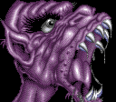{:width="128" height="112"}{:.right}
- HP: 10
- Verb: Bites
- Damage: 8-11
- XP: 72
- Attack: 2
- Spell Attack: 2
- Gold: 5

**Worm**
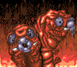{:width="128" height="112"}{:.right}
- HP: 8
- Verb: Bites
- Damage: 6-9
- XP: 56
- Attack: 2
- Spell Attack: 2
- Gold: 2

**Troll**
{:width="128" height="112"}{:.right}
- HP: 13
- Verb: Hits
- Damage: 10-13
- XP: 92
- Attack: 3
- Spell Attack: 3
- Gold: 10

**Vulture**
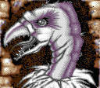{:width="128" height="112"}{:.right}
- HP: 15
- Verb: Picks
- Damage: 12-15
- XP: 108
- Attack: 3
- Spell Attack: 4
- Gold: 2

**Gnom Fighter**
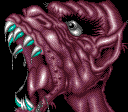{:width="128" height="112"}{:.right}
- HP: 18
- Verb: Slayes
- Damage: 15-18
- XP: 132
- Attack: 3
- Spell Attack: 4
- Gold: 9

**Silver Ninja**
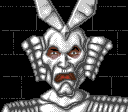{:width="128" height="112"}{:.right}
- HP: 22
- Verb: Stabs
- Damage: 17-20
- XP: 156
- Attack: 4
- Spell Attack: 4
- Gold: 20

**Master Troll**
{:width="128" height="112"}{:.right}
- HP: 19
- Verb: Slayes
- Damage: 19-22
- XP: 152
- Attack: 4
- Spell Attack: 4
- Gold: 25

**Gnom King**
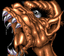{:width="128" height="112"}{:.right}
- HP: 20
- Verb: Stabs
- Damage: 12-15
- XP: 128
- Attack: 5
- Spell Attack: 4
- Gold: 50
- Special: 50% chance to cause Blinded.

**Spider**
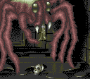{:width="128" height="112"}{:.right}
- HP: 25
- Verb: Bites
- Damage: 15-18
- XP: 160
- Attack: 5
- Spell Attack: 5
- Gold: 5
- Special: 50% chance to cause Poisened.

**Master Gnom**
{:width="128" height="112"}{:.right}
- HP: 28
- Verb: Stabs
- Damage: 16-19
- XP: 176
- Attack: 6
- Spell Attack: 5
- Gold: 35

**Pure Worm**
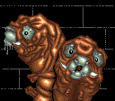{:width="128" height="112"}{:.right}
- HP: 40
- Verb: Bites
- Damage: 9-12
- XP: 196
- Attack: 7
- Spell Attack: 5
- Gold: 5
- Special: Can cast Shock (4-8 damage to all). 50% chance to cause Poisened.

**Silly Walker**
{:width="128" height="112"}{:.right}
- HP: 45
- Verb: Bites
- Damage: 20-23
- XP: 260
- Attack: 7
- Spell Attack: 6
- Gold: 90

**Magician**
{:width="128" height="112"}{:.right}
- HP: 50
- Verb: Hits
- Damage: 15-18
- XP: 260
- Attack: 7
- Spell Attack: 6
- Gold: 15
- Special: Can cast Acid Breath (28-36 damage to all). 50% chance to cause Blinded.

**Silly Guard**
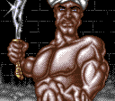{:width="128" height="112"}{:.right}
- HP: 55
- Verb: Stabs
- Damage: 25-28
- XP: 320
- Attack: 7
- Spell Attack: 7
- Gold: 5

**Hellgnom**
{:width="128" height="112"}{:.right}
- HP: 65
- Verb: Stabs
- Damage: 20-23
- XP: 340
- Attack: 7
- Spell Attack: 7
- Gold: 5
- Special: 50% chance to cause Poisened.

**Green Dragon**
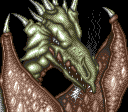{:width="128" height="112"}{:.right}
- HP: 85
- Verb: Scratchs
- Damage: 31-34
- XP: 464
- Attack: 7
- Spell Attack: 7
- Gold: 75
- Special: Can cast Flame Ball (15-26 damage to all). 50% chance to cause Stoned.

**Guard**
{:width="128" height="112"}{:.right}
- HP: 90
- Verb: Stabs
- Damage: 21-24
- XP: 444
- Attack: 7
- Spell Attack: 8
- Gold: 35
- Special: Can cast Acid Breath (28-36 damage to all).

**Hellworm**
{:width="128" height="112"}{:.right}
- HP: 99
- Verb: Bites
- Damage: 12-15
- XP: 444
- Attack: 9
- Spell Attack: 8
- Gold: 10
- Special: Can cast Swarm of Bees (7-16 damage to all). 50% chance to cause Stoned.

**Phantom**
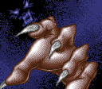{:width="128" height="112"}{:.right}
- HP: 35
- Verb: Scratchs
- Damage: 30-33
- XP: 260
- Attack: 7
- Spell Attack: 8
- Gold: 24
- Special: 50% chance to cause Stoned.

**Great Spider**
{:width="128" height="112"}{:.right}
- HP: 28
- Verb: Bites
- Damage: 22-25
- XP: 200
- Attack: 9
- Spell Attack: 8
- Gold: 5
- Special: 50% chance to cause Poisened.

**Thorndragon**
{:width="128" height="112"}{:.right}
- HP: 43
- Verb: Bites
- Damage: 44-47
- XP: 348
- Attack: 8
- Spell Attack: 9
- Gold: 125

**Alien**
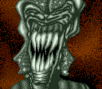{:width="128" height="112"}{:.right}
- HP: 70
- Verb: Bites
- Damage: 50-53
- XP: 480
- Attack: 11
- Spell Attack: 9
- Gold: 8
- Special: 50% chance to cause Poisened.

**Ninja**
{:width="128" height="112"}{:.right}
- HP: 55
- Verb: Stabs
- Damage: 55-58
- XP: 440
- Attack: 14
- Spell Attack: 9
- Gold: 130
- Special: 50% chance to cause Poisened.

**Devil**
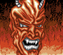{:width="128" height="112"}{:.right}
- HP: 80
- Verb: Hits
- Damage: 43-46
- XP: 492
- Attack: 9
- Spell Attack: 9
- Gold: 30
- Special: Can cast Flame Ball (15-26 damage to all). 50% chance to cause Stoned.

**Master Mage**
{:width="128" height="112"}{:.right}
- HP: 80
- Verb: Stabs
- Damage: 30-33
- XP: 440
- Attack: 9
- Spell Attack: 9
- Gold: 110

**Dragon**
{:width="128" height="112"}{:.right}
- HP: 90
- Verb: Scratchs
- Damage: 65-68
- XP: 620
- Attack: 14
- Spell Attack: 9
- Gold: 200
- Special: Can cast Flame Ball (15-26 damage to all).

**Vampire**
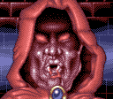{:width="128" height="112"}{:.right}
- HP: 22
- Verb: Bites
- Damage: 42-45
- XP: 256
- Attack: 11
- Spell Attack: 9
- Gold: 0
- Special: Can cast Eaglefang (15-26 damage to all). 50% chance to cause Blinded.

**Blue Dragon**
{:width="128" height="112"}{:.right}
- HP: 120
- Verb: Hits
- Damage: 70-73
- XP: 760
- Attack: 12
- Spell Attack: 9
- Gold: 150

**Woodoo Man**
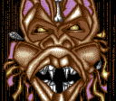{:width="128" height="112"}{:.right}
- HP: 50
- Verb: Hits
- Damage: 32-35
- XP: 328
- Attack: 10
- Spell Attack: 9
- Gold: 35
- Special: Can cast Poisened Arrow (9-16 damage to one target). 50% chance to cause Poisened.

**Fire Dragon**
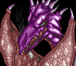{:width="128" height="112"}{:.right}
- HP: 225
- Verb: Hits
- Damage: 80-83
- XP: 1,220
- Attack: 13
- Spell Attack: 9
- Gold: 75
- Special: Can cast Air to Fire (25-38 damage to all).

**Fire Troll**
{:width="128" height="112"}{:.right}
- HP: 90
- Verb: Slayes
- Damage: 74-77
- XP: 656
- Attack: 15
- Spell Attack: 9
- Gold: 25
- Special: Can cast Air to Fire (25-38 damage to all).

**Dark Lord**
{:width="128" height="112"}{:.right}
- HP: 999
- Verb: Stabs
- Damage: 200-203
- XP: 4,796
- Attack: 20
- Spell Attack: 20
- Gold: 255
- Special: Can cast Deadly Flash (240-482 damage to one target). 50% chance to cause Stoned.

### Dungeon of Avalon II

| ID  |  HP | Verb| Dmg |Image| Atk |SpAtk|Spell|Stat |Gold | Name            |
|-----|-----|-----|-----|-----|-----|-----|-----|-----|-----|-----------------|
| $00 |  20 |   1 |   6 |  10 |   2 |   2 |   0 | $00 |   5 | Big Frog        |
| $01 |  18 |   1 |   8 |  11 |   2 |   2 |   0 | $00 |   2 | Big Turtle      |
| $02 |  23 |   6 |  10 |  12 |   3 |   3 |   0 | $80 |  10 | Pest Baby       |
| $03 |  25 |   1 |  12 |  13 |   3 |   4 |   0 | $00 |  20 | Slime Twin      |
| $04 |  28 |   4 |  15 |  14 |   3 |   4 |   0 | $00 |   5 | Eagle           |
| $05 |  32 |   1 |  20 |  15 |   4 |   4 |  28 | $80 |  20 | Werewolf        |
| $06 |  29 |   0 |  15 |  16 |   4 |   7 |   0 | $10 |  25 | Invisible       |
| $07 |  30 |   0 |  19 |  17 |   5 |   4 |  27 | $00 |  50 | Voodoo Man      |
| $08 |  35 |   6 |  25 |  18 |   5 |   5 |   0 | $00 |   5 | Alien           |
| $09 |  48 |   1 |  20 |  19 |   6 |   5 |   0 | $80 |  10 | Zombi           |
| $0A |  50 |   1 |  25 |  20 |   7 |   5 |   0 | $80 |   5 | Big Spider      |
| $0B |  55 |   0 |  40 |  21 |   7 |   6 |   0 | $00 |  90 | Dragon          |
| $0C |  60 |   0 |  20 |  22 |   7 |   6 |   0 | $40 |  90 | Devil           |
| $0D |  65 |   6 |  25 |  23 |   7 |   7 |   0 | $00 |  50 | Fire Troll      |
| $0E |  75 |   6 |  40 |  24 |   7 |   7 |  31 | $00 |  50 | Arc Dragon      |
| $0F |  95 |   6 |  30 |  25 |   7 |   7 |   0 | $80 |  75 | Skelleton       |
| $10 |  99 |   0 |  15 |  26 |   7 |   8 |   0 | $00 |  35 | Guardian        |
| $11 |  30 |   6 |  15 |  27 |   9 |   8 |   0 | $00 |  10 | Magician        |
| $12 | 256 |   6 | 100 |  28 |  20 |  20 |   0 | $00 | 128 | Lord Roa        |
| $13 |1024 |   6 | 200 |  28 |  20 |  20 |  35 | $40 | 255 | Lord Roa        |

**Big Frog**
{:width="128" height="112"}{:.right}
- HP: 20
- Verb: Bites
- Damage: 6-9
- XP: 104
- Attack: 2
- Spell Attack: 2
- Gold: 5

**Big Turtle**
{:width="128" height="112"}{:.right}
- HP: 18
- Verb: Bites
- Damage: 8-11
- XP: 104
- Attack: 2
- Spell Attack: 2
- Gold: 2

**Pest Baby**
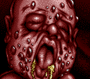{:width="128" height="112"}{:.right}
- HP: 23
- Verb: Slayes
- Damage: 10-13
- XP: 132
- Attack: 3
- Spell Attack: 3
- Gold: 10
- Special: 50% chance to cause Poisened.

**Slime Twin**
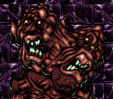{:width="128" height="112"}{:.right}
- HP: 25
- Verb: Bites
- Damage: 12-15
- XP: 148
- Attack: 3
- Spell Attack: 4
- Gold: 20

**Eagle**
{:width="128" height="112"}{:.right}
- HP: 28
- Verb: Picks
- Damage: 15-18
- XP: 172
- Attack: 3
- Spell Attack: 4
- Gold: 5

**Werewolf**
{:width="128" height="112"}{:.right}
- HP: 32
- Verb: Bites
- Damage: 20-23
- XP: 208
- Attack: 4
- Spell Attack: 4
- Gold: 20
- Special: Can cast Flame Tonge (6-11 damage to one target). 50% chance to cause Poisened.

**Invisible**
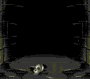{:width="128" height="112"}{:.right}
- HP: 29
- Verb: Hits
- Damage: 15-18
- XP: 176
- Attack: 4
- Spell Attack: 7
- Gold: 25
- Special: 50% chance to cause Blinded.

**Voodoo Man**
{:width="128" height="112"}{:.right}
- HP: 30
- Verb: Hits
- Damage: 19-22
- XP: 196
- Attack: 5
- Spell Attack: 4
- Gold: 50
- Special: Can cast Flame Sword (9-17 damage to one target).

**Alien**
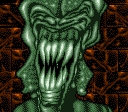{:width="128" height="112"}{:.right}
- HP: 35
- Verb: Slayes
- Damage: 25-28
- XP: 240
- Attack: 5
- Spell Attack: 5
- Gold: 5

**Zombi**
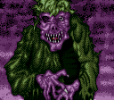{:width="128" height="112"}{:.right}
- HP: 48
- Verb: Bites
- Damage: 20-23
- XP: 272
- Attack: 6
- Spell Attack: 5
- Gold: 10
- Special: 50% chance to cause Poisened.

**Big Spider**
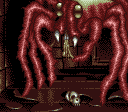{:width="128" height="112"}{:.right}
- HP: 50
- Verb: Bites
- Damage: 25-28
- XP: 300
- Attack: 7
- Spell Attack: 5
- Gold: 5
- Special: 50% chance to cause Poisened.

**Dragon**
{:width="128" height="112"}{:.right}
- HP: 55
- Verb: Hits
- Damage: 40-43
- XP: 380
- Attack: 7
- Spell Attack: 6
- Gold: 90

**Devil**
{:width="128" height="112"}{:.right}
- HP: 60
- Verb: Hits
- Damage: 20-23
- XP: 320
- Attack: 7
- Spell Attack: 6
- Gold: 90
- Special: 50% chance to cause Stoned.

**Fire Troll**
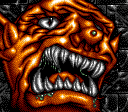{:width="128" height="112"}{:.right}
- HP: 65
- Verb: Slayes
- Damage: 25-28
- XP: 360
- Attack: 7
- Spell Attack: 7
- Gold: 50

**Arc Dragon**
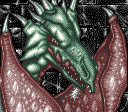{:width="128" height="112"}{:.right}
- HP: 75
- Verb: Slayes
- Damage: 40-43
- XP: 460
- Attack: 7
- Spell Attack: 7
- Gold: 50
- Special: Can cast Firefist (14-20 damage to one target).

**Skelleton**
{:width="128" height="112"}{:.right}
- HP: 95
- Verb: Slayes
- Damage: 30-33
- XP: 500
- Attack: 7
- Spell Attack: 7
- Gold: 75
- Special: 50% chance to cause Poisened.

**Guardian**
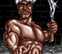{:width="128" height="112"}{:.right}
- HP: 99
- Verb: Hits
- Damage: 15-18
- XP: 456
- Attack: 7
- Spell Attack: 8
- Gold: 35

**Magician**
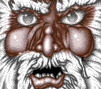{:width="128" height="112"}{:.right}
- HP: 30
- Verb: Slayes
- Damage: 15-18
- XP: 180
- Attack: 9
- Spell Attack: 8
- Gold: 10

**Lord Roa** (fake)
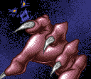{:width="128" height="112"}{:.right}
- HP: 256
- Verb: Slayes
- Damage: 100-103
- XP: 1,424
- Attack: 20
- Spell Attack: 20
- Gold: 128

**Lord Roa** (real)
{:width="128" height="112"}{:.right}
- HP: 1,024
- Verb: Slayes
- Damage: 200-203
- XP: 4,896
- Attack: 20
- Spell Attack: 20
- Gold: 255
- Special: Can cast Air To Fire (25-38 damage to all). 50% chance to cause Stoned.
